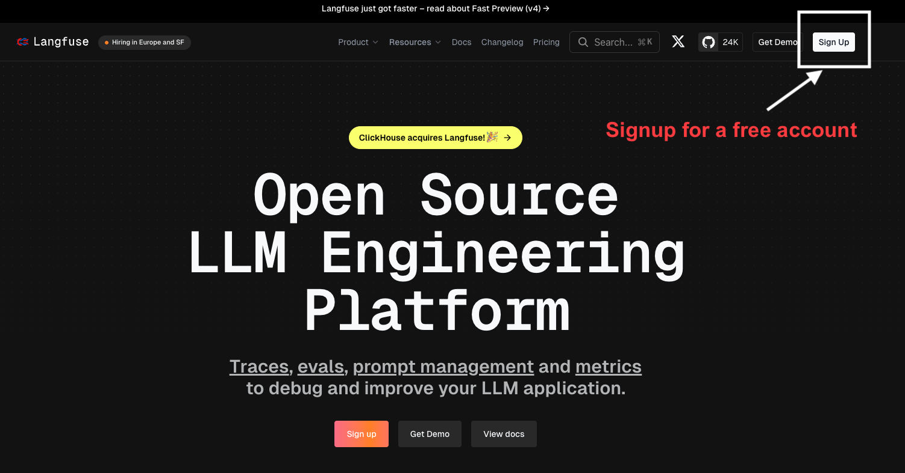
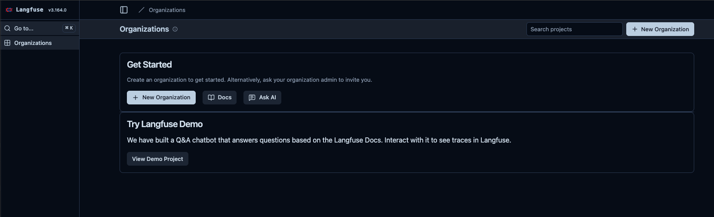
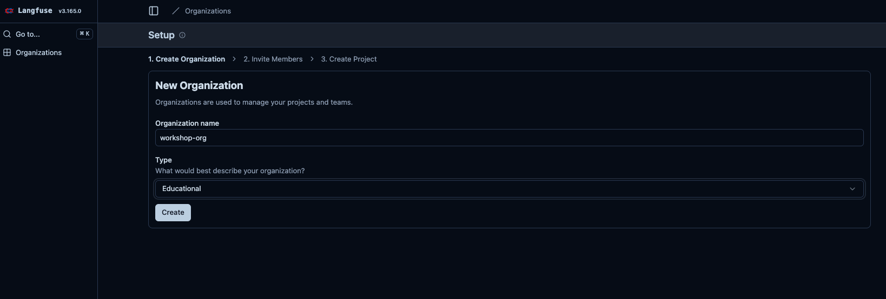
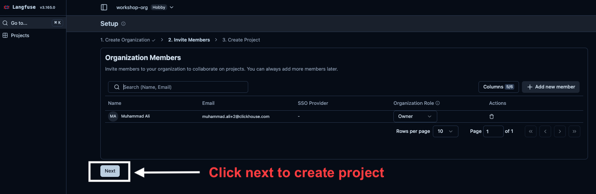
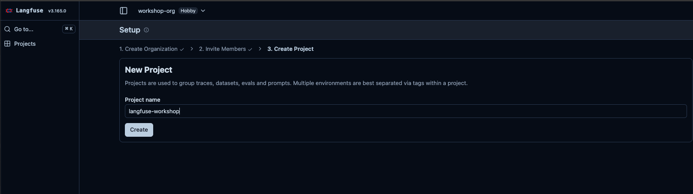
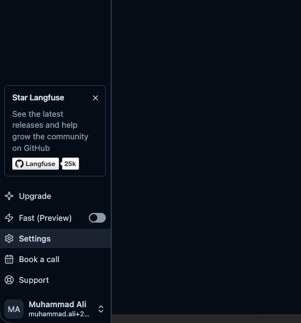
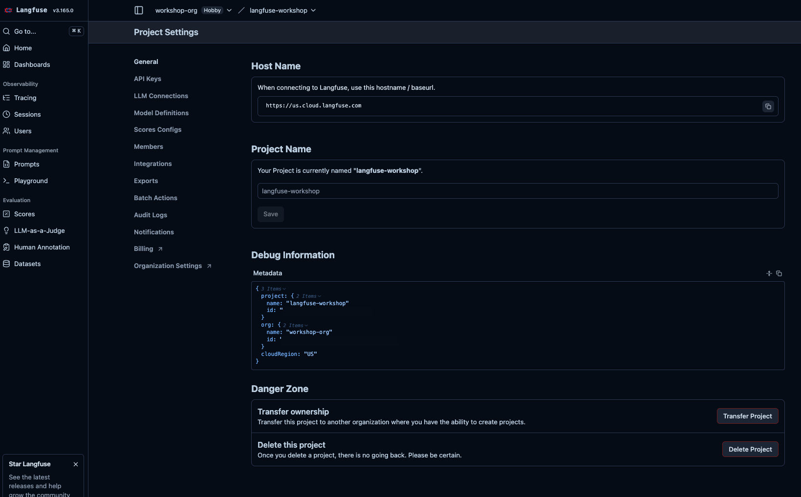
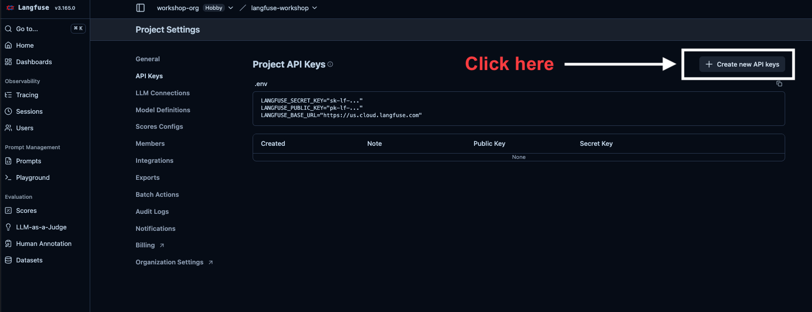
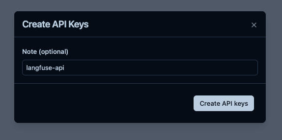
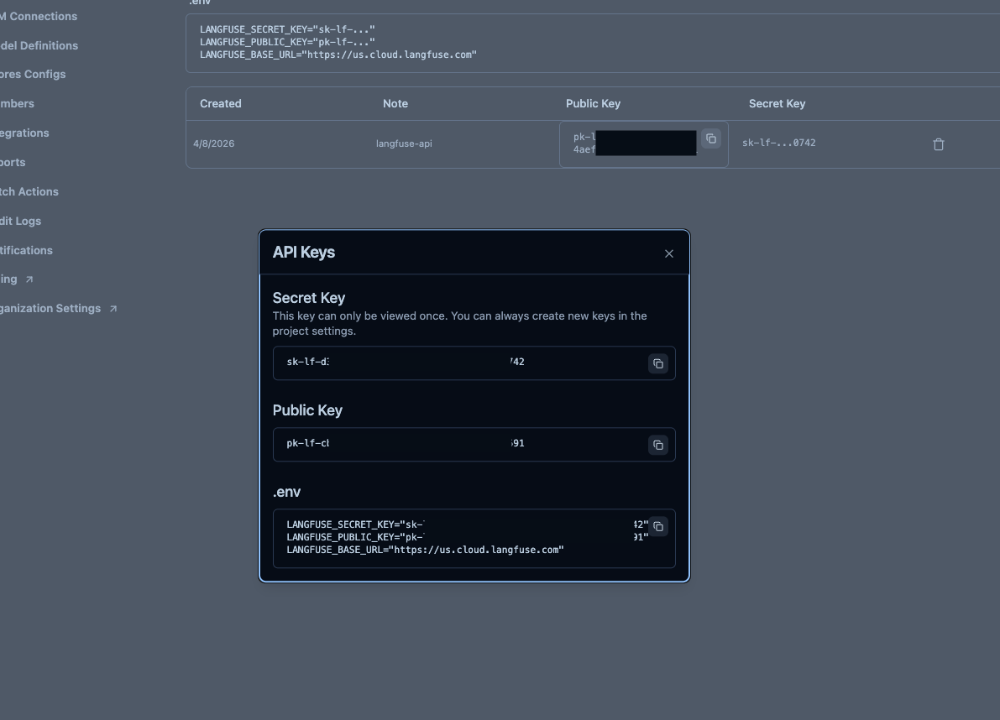

# Lab 1: Getting Started with Langfuse

In this lab you'll create a Langfuse account, set up an organization and project, and get your API keys. By the end you'll have everything needed to connect your application to Langfuse.

---

## Step 1: Sign Up

Go to [cloud.langfuse.com](https://cloud.langfuse.com) and click **Sign Up** in the top right corner.



Create an account with your email or sign in with Google/GitHub.

---

## Step 2: Create an Organization

After signing in you land on the **Organizations** page. An organization is the top-level container for your team — it holds members, billing, and one or more projects.



Click **New Organization**. Give it a name (e.g. `workshop-org`) and select a type.



Click **Create**.

---

## Step 3: Invite Members (optional) and Create a Project

Langfuse walks you through a 3-step setup wizard. Step 2 lets you invite team members — you can skip this for now by clicking **Next**.



Step 3 creates your first **Project**. A project is an isolated workspace that holds all the traces, prompts, datasets, and scores for one application. Give it a name (e.g. `langfuse-workshop`) and click **Create**.



> **Tip**: In production you'd typically have separate projects per environment — `my-app-production` and `my-app-staging` — so traces don't mix.

---

## Step 4: Navigate to Project Settings

Once inside your project, scroll to the bottom of the left sidebar and click **Settings**.



This opens the **Project Settings** page where you can see your project name, host name, and debug information.



In the left settings menu, click **API Keys**.

---

## Step 5: Create an API Key

On the **API Keys** page you'll see any existing keys. Click **Create new API key** in the top right.



Give the key a note so you can identify it later (e.g. `langfuse-api`) and click **Create API keys**.



---

## Step 6: Copy Your Keys

The dialog shows your keys **once** — the Secret Key cannot be retrieved again after you close this dialog. Copy all three values into your `.env` file now.



Langfuse even provides a pre-formatted `.env` snippet at the bottom of the dialog. Copy it directly into your `.env` file:

```env
LANGFUSE_SECRET_KEY="sk-lf-..."
LANGFUSE_PUBLIC_KEY="pk-lf-..."
LANGFUSE_BASE_URL="https://us.cloud.langfuse.com"
```

> **EU vs US**: The `LANGFUSE_BASE_URL` will be `https://cloud.langfuse.com` for EU region or `https://us.cloud.langfuse.com` for US region. Use whichever region you signed up on.

---

## Checkpoint

- [ ] Langfuse account created
- [ ] Organization created
- [ ] Project created (e.g. `langfuse-workshop`)
- [ ] API keys copied into `.env`

Once your `.env` is filled in, verify the connection works by running the check from Lab 0:

```bash
source .venv/bin/activate
python
```

```python
from dotenv import load_dotenv
load_dotenv()
from langfuse import get_client
print(get_client().auth_check())  # Should print True
```

If you see `True`, you're connected and ready for **Lab 2: Basic Tracing**.
