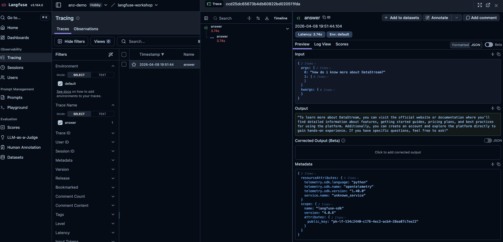

# Lab 1: Basic Tracing

## Concept

When an LLM application fails or behaves unexpectedly, where do you look? Without observability, you're debugging blind — no visibility into what prompt was sent, what the model returned, how long it took, or where in the pipeline things went wrong.

**Langfuse traces** give you a structured record of every request through your system:
- The full input and output at each step
- Timing for every operation
- Nested structure showing how calls relate to each other
- Cost and token usage

A **trace** represents one end-to-end request (e.g., a user asking a question). Within it, **observations** represent individual steps — an LLM call, a retrieval step, a tool execution.

```
Trace: "answer user question"
├── Span: "retrieve context"       ← retrieval step
└── Generation: "llm call"         ← LLM call (tracks model, tokens, cost)
```

The simplest way to create traces in Langfuse is the `@observe` decorator — wrap a function and Langfuse automatically captures its name, inputs, outputs, and timing.

---

## What You'll Build

Instrument `app/assistant.py` so that every question answered creates a trace in Langfuse with:
- A root span for the full `answer()` call
- A child span for the retrieval step
- A generation for the LLM call

### The app you're instrumenting

Open `app/assistant.py` and read through it before starting. Here's what each part does:

- **`SYSTEM_PROMPT`** — the instructions given to the model on every request, defining its persona and behaviour
- **`retrieve(question)` / `format_context(docs)`** — imported from `app/knowledge_base.py`; these do a simple keyword search over an in-memory set of DataStream docs and return the most relevant ones as a text block
- **`answer(question, history)`** — the main function you'll be modifying; it retrieves context, builds the message list (system prompt + conversation history + user question + context), calls OpenAI, and returns the response string

The flow is: **user question → retrieve docs → build messages → call LLM → return answer**. That's exactly the structure your trace will reflect.

---

## Tasks

### Task 1.1 — Add the `@observe` decorator to `answer()`

Open `app/assistant.py`. Import and apply `@observe` to the `answer` function.

```python
from langfuse import observe

@observe()
def answer(question: str, history: list[dict] | None = None) -> str:
    ...
```

Run the app, ask a question, then check your Langfuse dashboard. You should see a trace appear.

```bash
python -m app.main
```

In Langfuse, go to **Tracing → Traces**. You'll see a list of traces — one per question you asked. Each row shows the trace name, when it ran, and a preview of the input.


Click on a trace to open the detail view. You'll see:
- **Input** — the exact arguments passed to `answer()` (the question and history)
- **Output** — the string returned by `answer()`
- **Metadata** — timing, tags, and any other attributes attached to the trace



> **What happened?** `@observe` automatically captured the function name, its arguments as input, and its return value as output. It also recorded the start and end time.

---

### Task 1.2 — Add a span for retrieval

The trace shows the full `answer()` call, but we want to see the retrieval step separately. Wrap the retrieval logic in its own `@observe`-decorated function.

```python
@observe()
def retrieve_context(question: str) -> str:
    docs = retrieve(question)
    return format_context(docs)
```

Then call `retrieve_context(question)` from inside `answer()` instead of calling `retrieve` and `format_context` directly.

Ask another question and check the trace. You should now see a **nested** span for retrieval inside the root trace.

> **Key concept**: When one `@observe`-decorated function calls another, Langfuse automatically creates a parent-child relationship between the spans.

---

### Task 1.3 — Track the LLM call as a generation

LLM calls are special — Langfuse has a dedicated type for them called a **generation** that tracks model name, token usage, and cost. Wrap the OpenAI call in an `@observe(as_type="generation")` decorated function.

```python
@observe(as_type="generation")
def call_llm(messages: list[dict]) -> str:
    response = client.chat.completions.create(
        model=os.getenv("APP_MODEL", "gpt-4o-mini"),
        messages=messages,
        temperature=0.3,
    )
    return response.choices[0].message.content
```

Call `call_llm(messages)` from inside `answer()`.

> **Note**: The `@observe` decorator captures return values automatically. For generations, Langfuse also infers token counts when the full response object is returned. We'll improve this in Lab 2.

---

### Task 1.4 — Flush on exit

In a long-running server, Langfuse sends data in the background. In a short-lived script, you need to flush manually to ensure all events are sent before the process exits.

Add to `app/main.py`:

```python
from langfuse import get_client

# At the end of main(), after the loop:
get_client().flush()
```

---

## Checkpoint

Run the app and ask 2-3 questions. In your Langfuse dashboard:

- [ ] Each question creates a new trace
- [ ] Each trace has a nested retrieval span and an LLM generation
- [ ] The inputs and outputs are visible on each span
- [ ] The generation shows a model name

---

## Explore the UI

In your Langfuse project, go to **Traces**. Click into a trace and explore:
- The timeline view shows span durations
- Click a generation to see the full prompt and completion
- The "Input / Output" tab shows what was sent and received

---

## Solution

See [`solution.py`](./solution.py) for the complete instrumented `assistant.py`.
