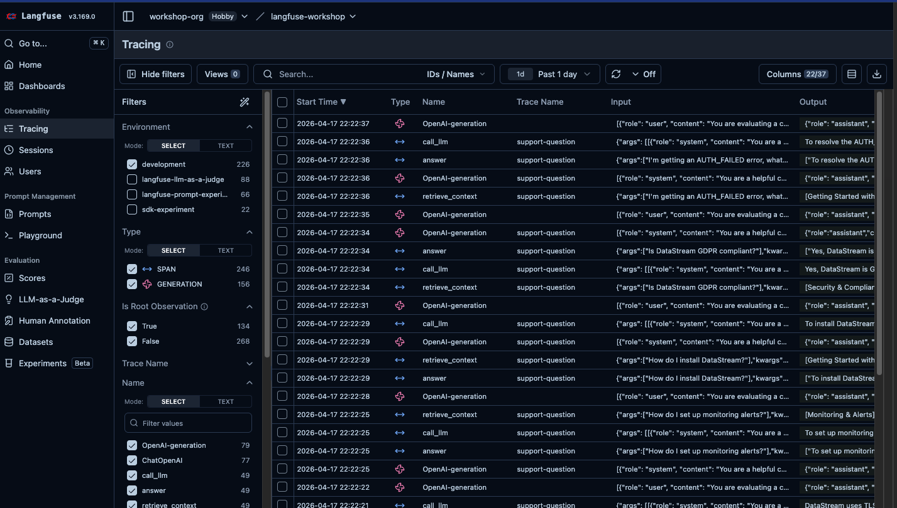
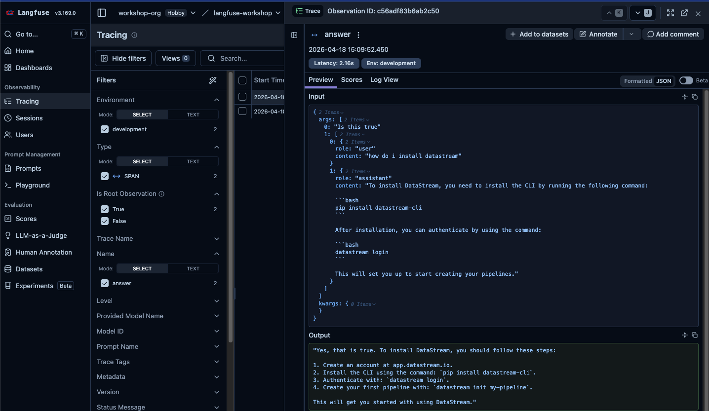
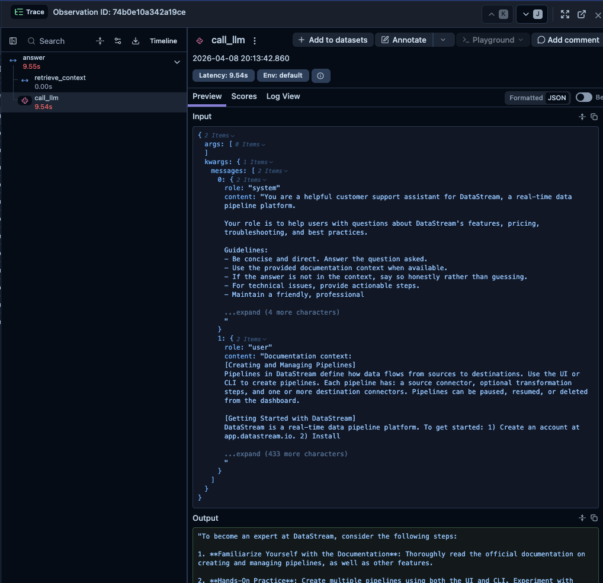
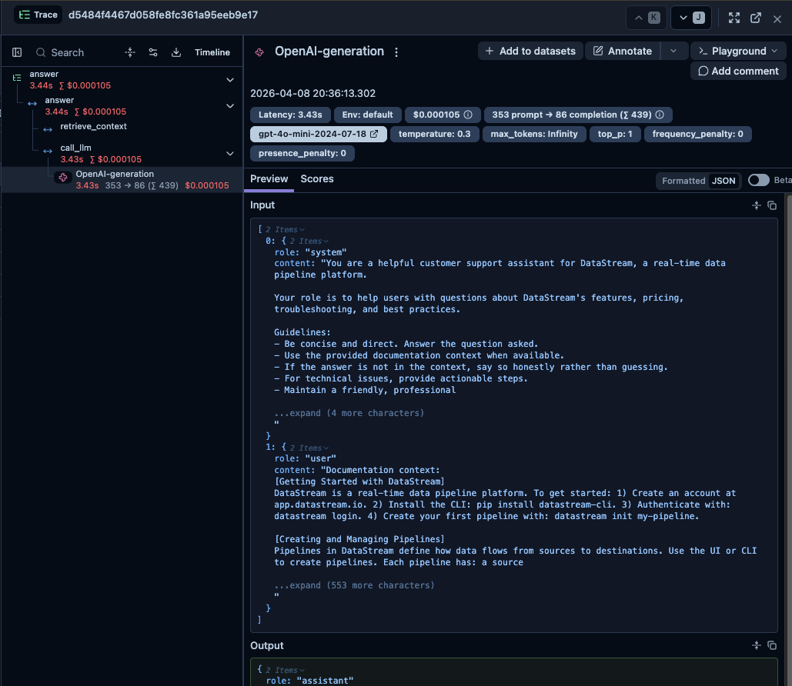
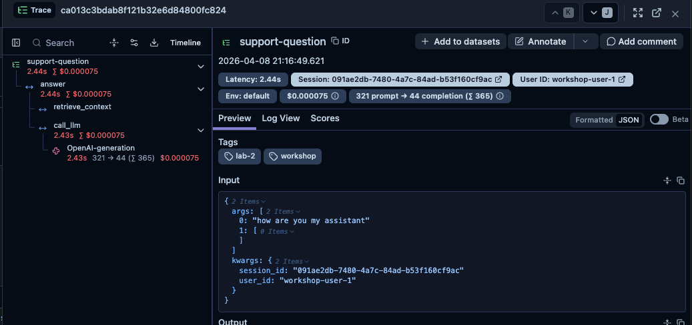
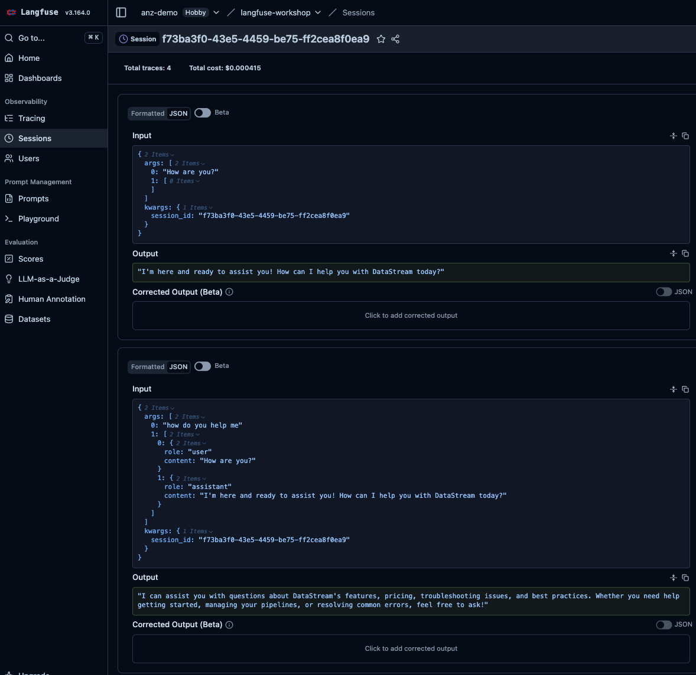

# Lab 2: Instrumentation

## Concept

When an LLM application fails or behaves unexpectedly, where do you look? Without observability, you're debugging blind — no visibility into what prompt was sent, what the model returned, how long it took, or where in the pipeline things went wrong.

**Langfuse traces** give you a structured record of every request through your system:
- The full input and output at each step
- Timing for every operation
- Nested structure showing how calls relate to each other
- Cost and token usage

A **trace** represents one end-to-end request (e.g., a user asking a question). Within it, **observations** represent individual steps — an LLM call, a retrieval step, a tool execution.

```
Trace: "support-question"
├── Span: "retrieve_context"      ← retrieval step
└── Generation: OpenAI call        ← model, tokens, and USD cost
```

The simplest way to create traces in Langfuse is the `@observe` decorator. The `langfuse.openai` drop-in then captures tokens and cost automatically. And `propagate_attributes` lets you attach trace-level data — a name, a session, a user, tags, metadata, an environment — without threading it through every function call.

---

## What You'll Build

Instrument `app/assistant.py` so that every question creates a rich Langfuse trace with:
- A root span for the full `answer()` call, named `support-question`
- A child span for retrieval
- A generation for the LLM call with model, token counts, and cost
- A session grouping multiple turns of one conversation
- A user ID, workshop tags, and metadata on every trace
- An `environment` tag so dev traffic stays separate from production

### The app you're instrumenting

Open `app/assistant.py` and read through it before starting. Here's what each part does:

- **`SYSTEM_PROMPT`** — the instructions given to the model on every request, defining its persona and behaviour
- **`retrieve(question)` / `format_context(docs)`** — imported from `app/knowledge_base.py`. Open that file and have a quick look: it contains a list of DataStream documentation entries (each with a title, content, and tags), and a `retrieve()` function that scores each entry by counting how many words from the query appear in it, returning the top matches. `format_context()` then joins those matches into a single text block that gets inserted into the prompt.
- **`answer(question, history)`** — the main function you'll be modifying; it retrieves context, builds the message list (system prompt + conversation history + user question + context), calls OpenAI, and returns the response string

The flow is: **user question → retrieve docs → build messages → call LLM → return answer**. That's exactly the structure your trace will reflect.

---

## Tasks

### Task 2.1 — Your first trace

We start with the smallest possible change: one import, one decorator. The goal is to see the feedback loop work — file change → Gradio reload → ask a question → trace appears in Langfuse. We'll add detail in the next task.

**File: `app/assistant.py`** — add this import at the top:
```python
from langfuse import observe
```

Then add `@observe()` directly above `answer()` — **don't change the function body**:
```python
@observe()
def answer(question: str, history: list[dict] | None = None) -> str:
    # ... existing code unchanged ...
```

That's it. Save the file — Gradio reloads automatically. Ask a question in the browser, then check Langfuse.

> If the app isn't running yet: `uv run gradio app/web.py`, then open <a href="http://localhost:7860" target="_blank">http://localhost:7860</a>

In Langfuse, go to **Tracing** — you'll land on the observations table, where every decorated function call appears as a row.

> **Set up a saved view (do this once now):** The table shows every observation. Filter to just your root calls:
> 1. Open the filter sidebar and add: `name = "answer"`
> 2. Click **Save view** and name it `Workshop – answer calls`
>
> We'll rename the trace in the next task — for now this filter lets you find your work easily.



Click your new row. The detail panel shows:
- **Input** — the exact arguments passed to `answer()` (the question and history)
- **Output** — the string returned by `answer()` (the assistant's reply)
- **Metadata** — duration, timing, tags



> **What just happened?** `@observe` is an interceptor. It captured the function's name, arguments, return value, and duration — and sent all of that to Langfuse as one observation. Zero changes to your business logic. The next task adds the structure that makes traces useful for debugging.

---

### Task 2.2 — Split the pipeline, capture tokens, and name the trace

Now the bigger step. We'll go from "one observation per question" to a full production-ready trace. In one change you:

1. Split the pipeline into a root span (`answer`) and two children (`retrieve_context`, `call_llm`) so retrieval and the LLM call show up separately
2. Switch the OpenAI import to `langfuse.openai` — a **drop-in wrapper** that automatically captures model name, token counts, and cost on every API call
3. Rename the trace to `support-question` so it's identifiable at scale

Replace the contents of `app/assistant.py` with:

**File: `app/assistant.py`**
```python
import os
from langfuse.openai import OpenAI  # drop-in: auto-captures tokens, model, cost
from langfuse import observe, propagate_attributes
from app.knowledge_base import retrieve, format_context

client = OpenAI()

SYSTEM_PROMPT = """You are a helpful customer support assistant for DataStream, a real-time data pipeline platform.

Your role is to help users with questions about DataStream's features, pricing, troubleshooting, and best practices.

Guidelines:
- Be concise and direct. Answer the question asked.
- Use the provided documentation context when available.
- If the answer is not in the context, say so honestly rather than guessing.
- For technical issues, provide actionable steps.
- Maintain a friendly, professional tone.
"""


@observe()
def retrieve_context(question: str) -> str:
    docs = retrieve(question)
    return format_context(docs)


@observe()  # plain span — the openai wrapper creates the generation inside it
def call_llm(messages: list[dict]) -> str:
    response = client.chat.completions.create(
        model=os.getenv("APP_MODEL", "gpt-4o-mini"),
        messages=messages,
        temperature=0.3,
    )
    return response.choices[0].message.content


@observe(name="support-question")
def answer(question: str, history: list[dict] | None = None) -> str:
    with propagate_attributes(trace_name="support-question"):
        context = retrieve_context(question)

        messages = [{"role": "system", "content": SYSTEM_PROMPT}]
        if history:
            messages.extend(history)
        messages.append({
            "role": "user",
            "content": f"Documentation context:\n{context}\n\nQuestion: {question}"
        })

        return call_llm(messages)
```

Save the file — Gradio reloads automatically. Ask a question in the browser, then open the new observation in Langfuse.

> **Update your saved view:** change the filter to `name = "support-question"` (or create a new saved view `Workshop – support-question`).

You should now see a tree with three nodes:



`retrieve_context` and `call_llm` are nested beneath `support-question`. Clicking `call_llm` shows the full messages array (system prompt + retrieved context + user question) as **Input**, and the model's reply as **Output**.

Click into the generation node — the OpenAI wrapper has added rich metadata that wouldn't be there without it:



Notice the **model name**, **token counts** (input, output, total), and an estimated **cost in USD**. The OpenAI wrapper inferred all of that automatically.

And the trace name appears at the top of the trace detail panel:



> **Why plain `@observe()` on `call_llm` and not `@observe(as_type="generation")`?** The `langfuse.openai` wrapper creates the generation observation automatically inside `call_llm`. Marking the outer span as a generation would create a duplicate nested generation.

> **Other model providers**: Langfuse offers drop-in integrations for most major providers and frameworks. For example:
> - **Anthropic** *(interesting one)*: Anthropic exposes an OpenAI-compatible API, so you can reuse the same `from langfuse.openai import OpenAI` wrapper — just swap `api_key`, `base_url`, and the model name. No new SDK.
> - **AWS Bedrock**: wrap calls using the `@observe()` decorator with manual usage reporting
> - **Google Gemini / Vertex AI**: native Langfuse integrations available
> - **LiteLLM**: `litellm.callbacks = ["langfuse_otel"]` — one line to trace any of the 100+ models LiteLLM supports
> - **LangChain / LangGraph**: pass `CallbackHandler` from `langfuse.callback`
> - **LlamaIndex**: register the Langfuse handler once at startup
>
> The full list is at [langfuse.com/integrations](https://langfuse.com/integrations). For this workshop we use OpenAI directly, but the patterns apply identically.

---

### Task 2.3 — Group conversation turns into sessions

Right now each question creates an independent trace. But your app supports multi-turn conversations — logically, all turns of a conversation should be grouped.

Langfuse uses a `session_id` for this. Add `uuid` to the imports and pass `session_id` through `propagate_attributes`:

**File: `app/assistant.py`**
```python
# add to imports at the top:
import uuid

# replace answer() with:
@observe(name="support-question")
def answer(
    question: str,
    history: list[dict] | None = None,
    session_id: str | None = None,
) -> str:
    with propagate_attributes(
        trace_name="support-question",
        session_id=session_id or str(uuid.uuid4()),
    ):
        context = retrieve_context(question)

        messages = [{"role": "system", "content": SYSTEM_PROMPT}]
        if history:
            messages.extend(history)
        messages.append({
            "role": "user",
            "content": f"Documentation context:\n{context}\n\nQuestion: {question}"
        })

        return call_llm(messages)
```

> **Web app**: once `answer()` accepts `session_id`, `app/web.py` passes it automatically — no changes to `web.py` needed. Each browser tab gets its own session ID.

Ask a few questions in one browser tab. In Langfuse, go to **Sessions** — all questions from that tab should be grouped together.



The session view shows every conversation turn in order, each with its own Input and Output. This is what a support team uses to replay an entire customer conversation — every question asked, every answer given, in sequence. Without session tracking, these would appear as unrelated individual traces with no way to connect them.

---

### Task 2.4 — Add user ID, tags, and metadata

In a real app you'd have authenticated users. Simulate this by accepting a `user_id` argument and passing it as trace metadata alongside tags and a version field.

**File: `app/assistant.py`** — expand `propagate_attributes` in `answer()`:
```python
@observe(name="support-question")
def answer(
    question: str,
    history: list[dict] | None = None,
    session_id: str | None = None,
    user_id: str | None = None,
) -> str:
    with propagate_attributes(
        trace_name="support-question",
        session_id=session_id or str(uuid.uuid4()),
        user_id=user_id,
        tags=["workshop", "lab-2"],
        metadata={"app_version": "1.0.0"},
    ):
        context = retrieve_context(question)

        messages = [{"role": "system", "content": SYSTEM_PROMPT}]
        if history:
            messages.extend(history)
        messages.append({
            "role": "user",
            "content": f"Documentation context:\n{context}\n\nQuestion: {question}"
        })

        return call_llm(messages)
```

> **Web app**: once `answer()` accepts `user_id`, `app/web.py` passes `"workshop-user-1"` automatically — no changes to `web.py` needed.

After asking a question, go to **Observability → Users** in Langfuse. You'll see your user appear with their first and last event timestamps and a total trace count.


In production, each of your actual users would appear here. You can click a user to see all their traces, filter by user to debug a specific complaint, or track how frequently a user is interacting with your app. This is the starting point for understanding the per-user experience.

---

### Task 2.5 — Separate environments

In production you'll have development, staging, and production data all flowing into the same Langfuse project. Without environments they all mix together.

Add one line to your `.env` file (it's likely already there from `.env.example`):

```bash
LANGFUSE_TRACING_ENVIRONMENT=development
```

That's it — Langfuse picks it up automatically. Every trace you send now carries an `environment` attribute.

In the Langfuse UI, use the **Environment** filter (top of the Traces table) to show only `development` traces. When you deploy to production you'd set `LANGFUSE_TRACING_ENVIRONMENT=production` there and the two data streams stay completely separate — same project, same prompts, same datasets, different views.


> This is a one-line change that saves a lot of confusion when you start running the same app in multiple environments.

---

### Note — Flushing traces

With the Gradio web server running continuously, Langfuse's background thread sends batches automatically — no explicit `flush()` call is needed. If traces appear to be missing, wait a few seconds and refresh Langfuse.

> **For short-lived scripts** (like the offline evaluation scripts in Lab 6), you will call `get_client().flush()` explicitly before the script exits. That's the scenario flush was designed for.

---

## Checkpoint

Ask several questions across one browser tab. In Langfuse:

- [ ] Each question creates a trace named `support-question` in the saved view
- [ ] The trace has `support-question` → `retrieve_context` + `call_llm` as nested nodes
- [ ] The generation shows model, token counts, and estimated cost
- [ ] Multi-turn conversations group under a Session in the Sessions view
- [ ] `workshop-user-1` appears in the Users view
- [ ] The Environment filter shows only `development` traces

---

## Why This Matters

With user IDs and sessions, you can:
- Filter all traces for a specific user who reported a bug
- See the full conversation history for a support case
- Measure per-user token spend
- Identify users having bad experiences

With token usage and cost, you can:
- Build cost dashboards (cost per user, per feature, per day)
- Set budget alerts
- Compare cost across model versions

With environments, you can:
- Keep dev noise out of production dashboards
- Run the same code against the same Langfuse project across stages

---

## Solution

See [`solution/assistant.py`](./solution/assistant.py) for the fully instrumented assistant.

Next: **[Lab 3: Prompt Management](../03-prompt-management/README.md)**
