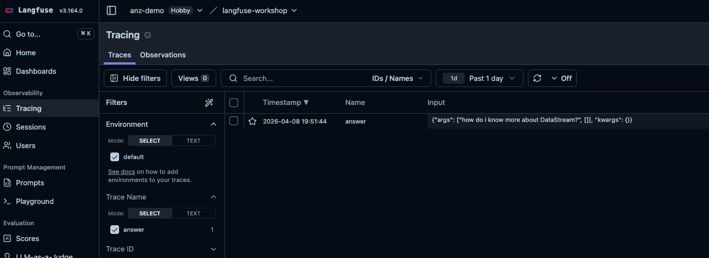
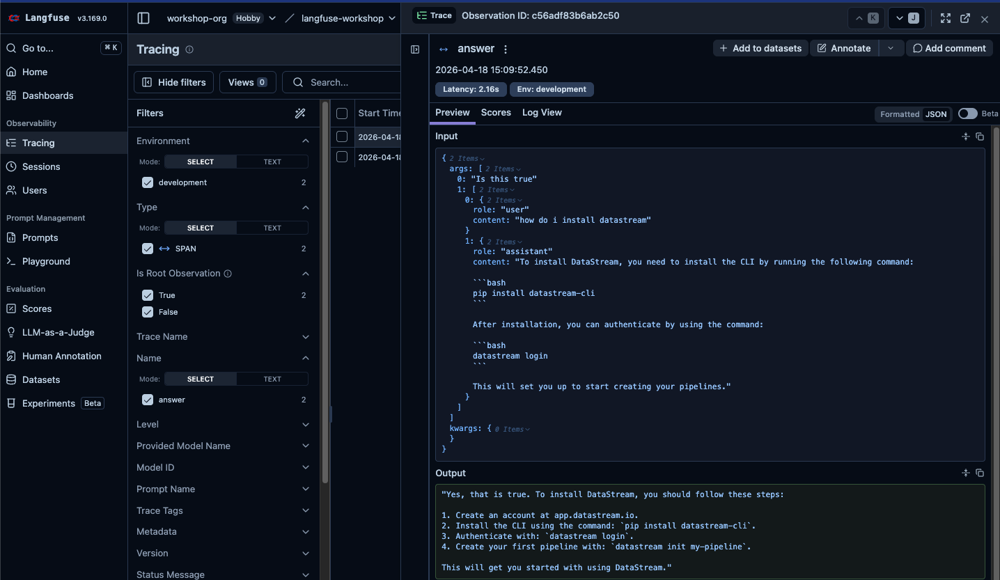
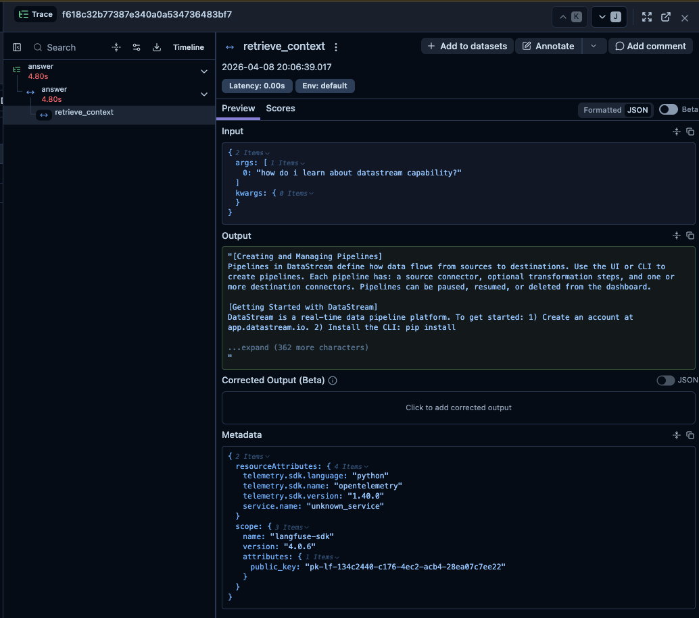
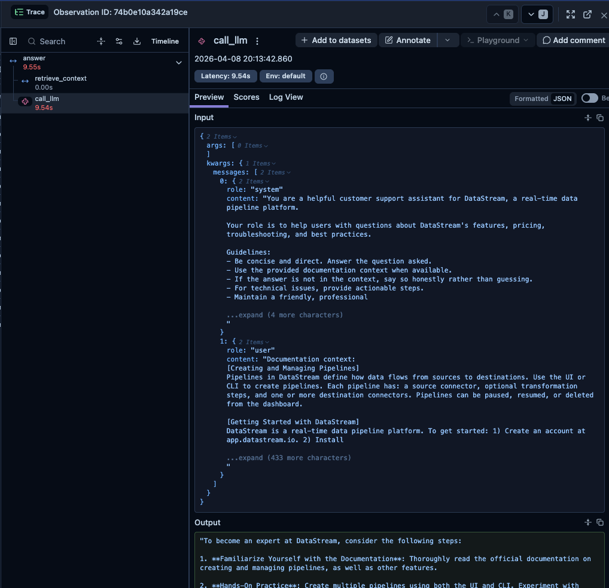

# Lab 2: Basic Tracing

## Concept

When an LLM application fails or behaves unexpectedly, where do you look? Without observability, you're debugging blind — no visibility into what prompt was sent, what the model returned, how long it took, or where in the pipeline things went wrong.

**Langfuse traces** give you a structured record of every request through your system:
- The full input and output at each step
- Timing for every operation
- Nested structure showing how calls relate to each other
- Cost and token usage

A **trace** represents one end-to-end request (e.g., a user asking a question). Within it, **observations** represent individual steps — an LLM call, a retrieval step, a tool execution.

```
Trace: "answer user question"
├── Span: "retrieve context"       ← retrieval step
└── Generation: "llm call"         ← LLM call (tracks model, tokens, cost)
```

The simplest way to create traces in Langfuse is the `@observe` decorator — wrap a function and Langfuse automatically captures its name, inputs, outputs, and timing.

---

## What You'll Build

Instrument `app/assistant.py` so that every question answered creates a trace in Langfuse with:
- A root span for the full `answer()` call
- A child span for the retrieval step
- A generation for the LLM call

### The app you're instrumenting

Open `app/assistant.py` and read through it before starting. Here's what each part does:

- **`SYSTEM_PROMPT`** — the instructions given to the model on every request, defining its persona and behaviour
- **`retrieve(question)` / `format_context(docs)`** — imported from `app/knowledge_base.py`. Open that file and have a quick look: it contains a list of DataStream documentation entries (each with a title, content, and tags), and a `retrieve()` function that scores each entry by counting how many words from the query appear in it, returning the top matches. `format_context()` then joins those matches into a single text block that gets inserted into the prompt. Find `retrieve()` at the top of `app/knowledge_base.py` — it's the function that starts with `def retrieve(query: str, top_k: int = 3)`
- **`answer(question, history)`** — the main function you'll be modifying; it retrieves context, builds the message list (system prompt + conversation history + user question + context), calls OpenAI, and returns the response string

The flow is: **user question → retrieve docs → build messages → call LLM → return answer**. That's exactly the structure your trace will reflect.

---

## Tasks

### Task 2.1 — Add the `@observe` decorator to `answer()`

Open `app/assistant.py`. Add the import at the top of the file, then add `@observe()` directly above `answer()`.

**File: `app/assistant.py`**
```python
# Add this import at the top of the file:
from langfuse import observe

# Add @observe() directly above the answer() function:
@observe()
def answer(question: str, history: list[dict] | None = None) -> str:
    # Retrieve relevant docs from the knowledge base
    docs = retrieve(question)
    context = format_context(docs)

    # Build the messages array: system prompt + conversation history + user question with context
    messages = [{"role": "system", "content": SYSTEM_PROMPT}]

    if history:
        messages.extend(history)

    messages.append({
        "role": "user",
        "content": f"Documentation context:\n{context}\n\nQuestion: {question}"
    })

    # Call the LLM and return the response
    response = client.chat.completions.create(
        model=os.getenv("APP_MODEL", "gpt-4o-mini"),
        messages=messages,
        temperature=0.3,
    )

    return response.choices[0].message.content
```

Run the app, ask a question, then check your Langfuse dashboard. You should see a trace appear.

```bash
python -m app.main
```

In Langfuse, go to **Tracing** — you'll land on the **observations table**, where every individual operation your app performs appears as its own row. This is Langfuse's primary view: each decorated function call is an observation you can query directly.

> **Set up a saved view (do this once now):** The observations table shows everything — LLM calls, retrieval steps, root spans, all mixed together. To keep the workshop tidy, filter the table to just your root `answer()` calls:
> 1. Open the filter sidebar and add: `name = "answer"`
> 2. Click **Save view** and name it `Workshop – answer calls`
>
> From here on, use this saved view to jump straight to your data with one click.



Click on any row to open the detail view. You'll see:
- **Input** — the exact arguments passed to `answer()` (the question and history)
- **Output** — the string returned by `answer()`
- **Metadata** — timing, tags, and any other attributes attached to the observation



> **What happened?** `@observe` automatically captured the function name, its arguments as input, and its return value as output. It also recorded the start and end time.

---

### Task 2.2 — Add a span for retrieval

The trace shows the full `answer()` call, but we want to see the retrieval step separately. Add a new `retrieve_context()` function in `app/assistant.py`, then update `answer()` to call it instead of calling `retrieve()` and `format_context()` directly.

**File: `app/assistant.py`** — add this new function above `answer()`:
```python
@observe()
def retrieve_context(question: str) -> str:
    docs = retrieve(question)
    return format_context(docs)
```

Then update `answer()` to use it (replace the two retrieval lines):

```python
@observe()
def answer(question: str, history: list[dict] | None = None) -> str:
    # Replace the direct retrieve() + format_context() calls with this:
    context = retrieve_context(question)

    # Build the messages array: system prompt + conversation history + user question with context
    messages = [{"role": "system", "content": SYSTEM_PROMPT}]

    if history:
        messages.extend(history)

    messages.append({
        "role": "user",
        "content": f"Documentation context:\n{context}\n\nQuestion: {question}"
    })

    # Call the LLM and return the response
    response = client.chat.completions.create(
        model=os.getenv("APP_MODEL", "gpt-4o-mini"),
        messages=messages,
        temperature=0.3,
    )

    return response.choices[0].message.content
```

Ask another question and check the trace. You should now see a **nested** span for retrieval inside the root trace.



Compared to the previous step, notice what's new: the left panel now shows a tree with two nodes — `answer` at the top and `retrieve_context` indented beneath it. Clicking `retrieve_context` shows its own Input (the question) and Output (the formatted docs text that was passed to the LLM). You can now see exactly what the retrieval step returned and how long it took, separately from the overall `answer` call.

> **Key concept**: When one `@observe`-decorated function calls another, Langfuse automatically creates a parent-child relationship between the spans.

> **Note**: `app/knowledge_base.py` does **not** need any Langfuse imports — it's a plain data file. The `@observe` decorator goes on `retrieve_context()` in `app/assistant.py`, which wraps the knowledge base functions.

---

### Task 2.3 — Track the LLM call as a generation

LLM calls are special — Langfuse has a dedicated type for them called a **generation** that tracks model name, token usage, and cost. Add a new `call_llm()` function in `app/assistant.py`, then update `answer()` to call it.

**File: `app/assistant.py`** — add this new function above `answer()`:
```python
@observe(as_type="generation")
def call_llm(messages: list[dict]) -> str:
    response = client.chat.completions.create(
        model=os.getenv("APP_MODEL", "gpt-4o-mini"),
        messages=messages,
        temperature=0.3,
    )
    return response.choices[0].message.content
```

Then update `answer()` to call `call_llm()` instead of calling `client.chat.completions.create()` directly:

```python
@observe()
def answer(question: str, history: list[dict] | None = None) -> str:
    context = retrieve_context(question)

    # Build the messages array: system prompt + conversation history + user question with context
    messages = [{"role": "system", "content": SYSTEM_PROMPT}]

    if history:
        messages.extend(history)

    messages.append({
        "role": "user",
        "content": f"Documentation context:\n{context}\n\nQuestion: {question}"
    })

    # Replace the direct client.chat.completions.create() call with this:
    return call_llm(messages)
```

Ask another question and open the trace. You'll now see all three nodes in the left panel: `answer` → `retrieve_context` and `call_llm` side by side beneath it.



Click on `call_llm`. This is where things get interesting — the Input shows the **full messages array** that was sent to the model: the system prompt, the retrieved documentation context, and the user's question all assembled together. The Output shows exactly what the model returned. This is the most valuable view for debugging — if the model gave a bad answer, you can see precisely what it was working with.

> **Note**: The `@observe` decorator captures return values automatically. For generations, Langfuse also infers token counts when the full response object is returned. We'll improve this in Lab 3.

> **Stay on `from openai import OpenAI` for now.** In Lab 3 you'll switch to `from langfuse.openai import OpenAI` — a drop-in replacement that auto-captures token counts and cost with no other code changes. Don't make that swap yet; it belongs in Lab 3.

---

### Task 2.4 — Flush on exit

In a long-running server, Langfuse sends data in the background. In a short-lived script, you need to flush manually to ensure all events are sent before the process exits.

**File: `app/main.py`** — add the import at the top and the flush call at the end of `main()`:
```python
# Add at the top of the file:
from langfuse import get_client

# Add at the end of main(), after the while loop (before the closing of the function):
get_client().flush()
```

---

## Checkpoint

Run the app and ask 2-3 questions. In your Langfuse dashboard:

- [ ] Each question creates a new trace
- [ ] Each trace has a nested retrieval span and an LLM generation
- [ ] The inputs and outputs are visible on each span
- [ ] The generation shows a model name

---

## Explore the UI

In your Langfuse project, go to **Traces**. Click into a trace and explore:
- The timeline view shows span durations
- Click a generation to see the full prompt and completion
- The "Input / Output" tab shows what was sent and received

---

## Solution

See [`solution/assistant.py`](./solution/assistant.py) for the instrumented assistant and [`solution/main.py`](./solution/main.py) for the updated entry point.
