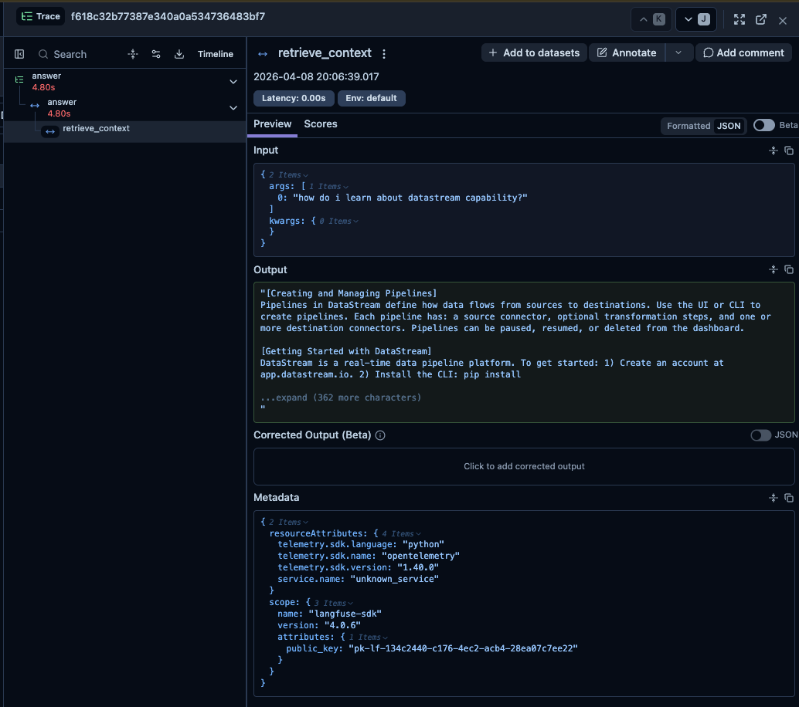
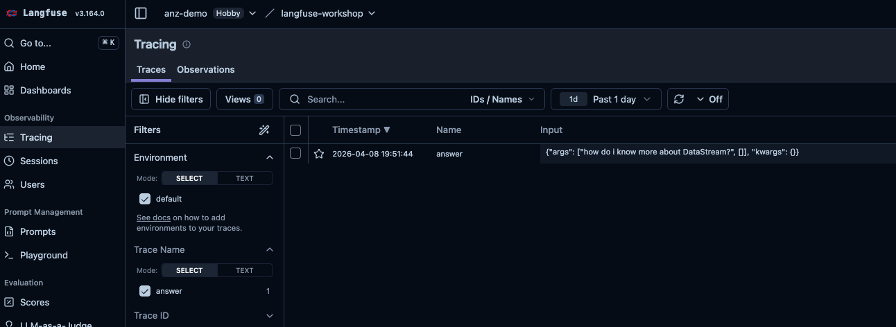

# Lab 2: Rich Tracing

## Concept

When an LLM application fails or behaves unexpectedly, where do you look? Without observability, you're debugging blind — no visibility into what prompt was sent, what the model returned, how long it took, or where in the pipeline things went wrong.

**Langfuse traces** give you a structured record of every request through your system:
- The full input and output at each step
- Latency for every operation
- Nested structure showing how calls relate to each other
- Model, token counts, and cost on LLM calls

A **trace** represents one end-to-end request (e.g., a user asking a question). Within it, **observations** represent individual steps — an LLM call, a retrieval step, a tool execution. There are different observation **types** — a plain span is one, a `generation` is the special type Langfuse uses for LLM calls so it can attach model, tokens and cost.

```
Trace: "support-question"
├── Span: "retrieve_context"           ← retrieval step
└── Span: "call_llm"
    └── Generation: gpt-4o-mini        ← LLM call (model, tokens, cost)
```

The simplest way to create traces in Langfuse is the `@observe` decorator — wrap a function and Langfuse automatically captures its name, inputs, outputs, and timing. We'll combine that with the **`langfuse.openai`** drop-in so every OpenAI call becomes a fully-typed generation automatically.

---

## What You'll Build

In this lab we go straight for **rich** tracing. By the end of the three tasks below, every question the user asks produces a trace with:

- A meaningful trace name (`support-question`) — not the raw function name
- Nested observations for retrieval and the LLM call
- A typed **generation** for the LLM call with model name, input/output tokens, total tokens and estimated cost
- Latency on every node

### The app you're instrumenting

Open `app/assistant.py` and read through it before starting. The current `answer()` does everything inline — retrieve, build messages, call OpenAI. To get a useful trace tree we'll split that into three named functions:

- **`retrieve_context(question)`** — wraps the keyword search from `app/knowledge_base.py` and returns the formatted text block injected into the prompt
- **`call_llm(messages)`** — wraps the OpenAI call so the LLM step shows up as its own node
- **`answer(question, history)`** — the root function the web UI calls, orchestrating the two above

The flow is: **user question → retrieve docs → build messages → call LLM → return answer**. That's exactly the structure your trace will reflect.

---

## Tasks

### Task 2.1 — Add nested observations with a meaningful trace name

We're adding three `@observe` decorators in one pass — one for the root, one for retrieval, one for the LLM call — and we're naming the root trace `support-question` from the very first trace. At scale you'll have many pipelines logging into the same project; the function name `answer` is far less useful in a filter than a meaningful name.

**File: `app/assistant.py`**

```python
# Add this import at the top of the file:
from langfuse import observe

# Add these two new functions above answer():
@observe()
def retrieve_context(question: str) -> str:
    docs = retrieve(question)
    return format_context(docs)


@observe()
def call_llm(messages: list[dict]) -> str:
    response = client.chat.completions.create(
        model=os.getenv("APP_MODEL", "gpt-4o-mini"),
        messages=messages,
        temperature=0.3,
    )
    return response.choices[0].message.content


# Replace the existing answer() with this — note the name="support-question":
@observe(name="support-question")
def answer(question: str, history: list[dict] | None = None) -> str:
    context = retrieve_context(question)

    messages = [{"role": "system", "content": SYSTEM_PROMPT}]
    if history:
        messages.extend(history)
    messages.append({
        "role": "user",
        "content": f"Documentation context:\n{context}\n\nQuestion: {question}"
    })

    return call_llm(messages)
```

Save the file — Gradio will reload automatically. Ask a question in the browser, then check your Langfuse dashboard. You should see a trace named `support-question` appear.

> If the web app isn't running yet: `uv run gradio app/web.py`, then open <a href="http://localhost:7860" target="_blank">http://localhost:7860</a>

In Langfuse, go to **Tracing** → **Traces**. You'll see your new trace at the top of the list, named `support-question`. Click it.



The left panel shows a tree with three nodes: `support-question` at the top, with `retrieve_context` and `call_llm` nested beneath. Clicking each node shows its own Input and Output:

- `support-question` — the original question and history
- `retrieve_context` — the question (in) and the formatted docs (out)
- `call_llm` — the full messages array (in), the assistant's reply (out)

> **Key concept**: When one `@observe`-decorated function calls another, Langfuse automatically creates a parent-child relationship between the observations. This is how a flat function call graph becomes a tree you can debug.

> **Note**: `app/knowledge_base.py` does **not** need any Langfuse imports — it's a plain data file.

---

### Task 2.2 — Capture cost, tokens, and the generation type

Right now the `call_llm` node shows the messages going in and the response coming out, but it has no idea this was an LLM call. There's no model name, no token count, no cost. Langfuse has a dedicated observation **type** for LLM calls — `generation` — and the simplest way to get one is the **Langfuse OpenAI drop-in**: a one-line import change that wraps the OpenAI client and automatically records model, tokens and cost for every call.

**File: `app/assistant.py`** — replace the OpenAI import at the top:

```python
# Before:
from openai import OpenAI

# After:
from langfuse.openai import OpenAI  # drop-in: auto-captures tokens, model, cost
```

That's the entire change. Don't touch the `@observe()` on `call_llm` — keep it as a plain span. The wrapper creates a `generation` observation inside it automatically.

Ask another question and open the trace. Inside `call_llm` you'll see a new child node with a different icon — that's the generation.


Click the generation. The top bar now shows:

- **Model** — e.g. `gpt-4o-mini`
- **Input tokens** / **Output tokens** / **Total tokens**
- **Estimated cost in USD**
- **Latency** — already there on every node, but particularly relevant for the LLM call

This is what powers cost dashboards, per-model comparisons, and per-user spend reports later on — all of it derived from the data the wrapper attaches automatically.

> **Other providers**: Langfuse offers the same drop-in pattern (or similar one-line integrations) for most major providers and frameworks:
> - **Anthropic**: Anthropic exposes an OpenAI-compatible API, so the same `from langfuse.openai import OpenAI` wrapper works — just swap `api_key`, `base_url`, and `model`.
> - **AWS Bedrock**: use `@observe()` with manual usage reporting.
> - **Google Gemini / Vertex AI**: native Langfuse integrations available.
> - **LiteLLM**: `litellm.callbacks = ["langfuse_otel"]` — one line to trace any of the 100+ models LiteLLM supports.
> - **LangChain / LangGraph**: pass `CallbackHandler` from `langfuse.callback`.
> - **LlamaIndex**: register the Langfuse handler once at startup.
>
> The full list is at [langfuse.com/integrations](https://langfuse.com/integrations). For this workshop we use OpenAI directly, but the patterns apply identically across all of them.

---

### Task 2.3 — Confirm everything is flowing

Ask 2–3 more questions in the browser. Each should produce a new `support-question` trace with the same structure: nested observations, a generation with tokens and cost, latency on every node.



> **Note — flushing traces**: With the Gradio web server running continuously, Langfuse's background thread sends batches automatically — no explicit `flush()` call is needed. If traces appear to be missing, wait a few seconds and refresh Langfuse.
>
> **For short-lived scripts** (like the offline eval scripts in Lab 7), you will call `get_client().flush()` explicitly before the script exits. That's the scenario flush was designed for.

---

## Checkpoint

After asking a few questions, in your Langfuse dashboard:

- [ ] Each question creates a new trace named `support-question`
- [ ] Each trace has `support-question` → `retrieve_context` + `call_llm` nested
- [ ] `call_llm` contains a typed **generation** with model, token counts, and cost
- [ ] Latency is visible on every node

---

## Why This Matters

In one lab you've gone from zero observability to a trace tree that tells you:

- What the user asked
- What the retrieval step returned (so you can spot bad retrieval before blaming the model)
- Exactly what was sent to the model (system prompt + context + question)
- What the model returned, how many tokens it used, and how much it cost
- How long each step took

That's the foundation for everything that follows — sessions, scores, evals, experiments.

---

## Solution

See [`solution/assistant.py`](./solution/assistant.py) for the instrumented assistant.
