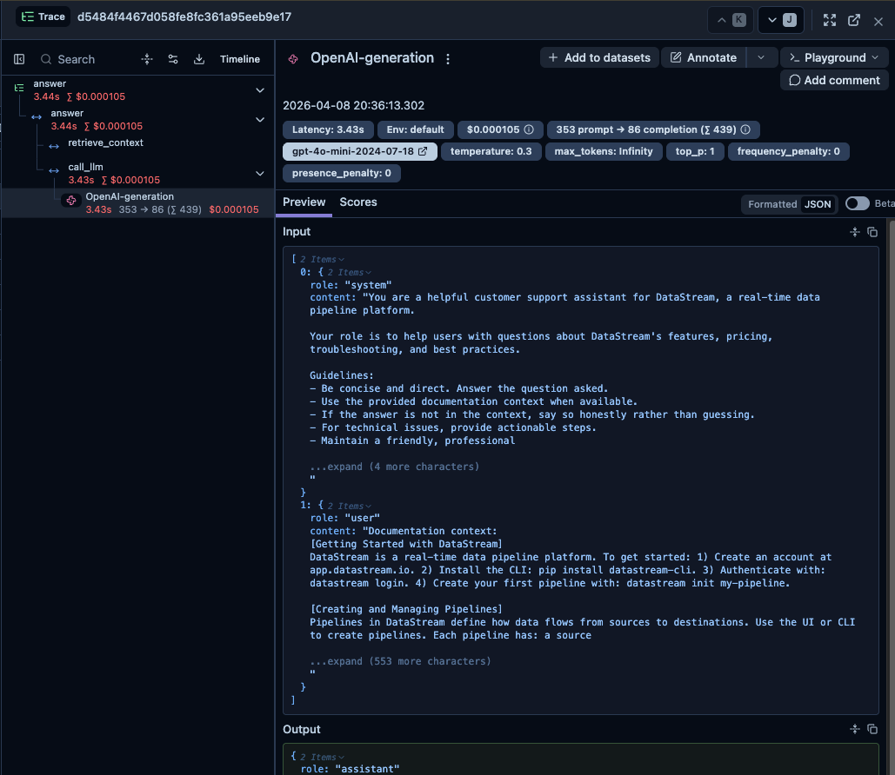
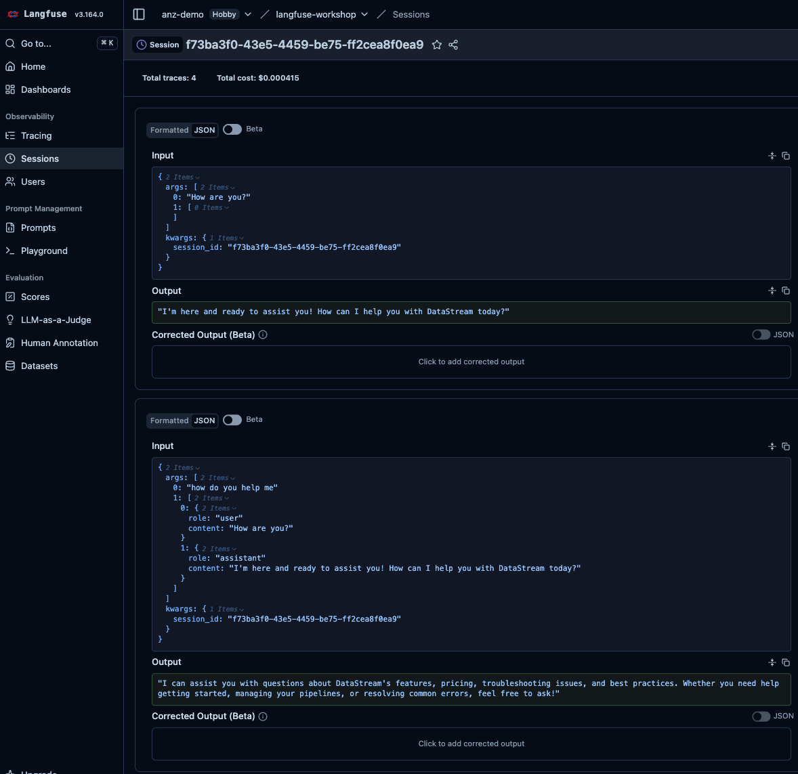
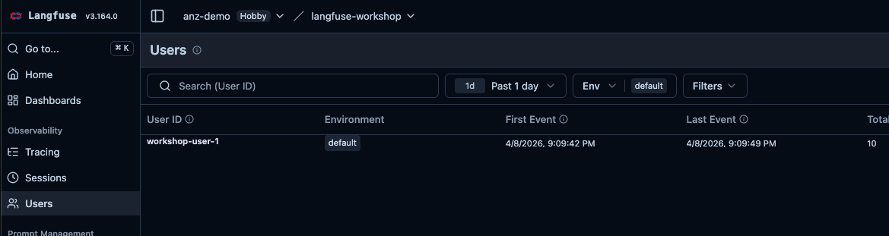
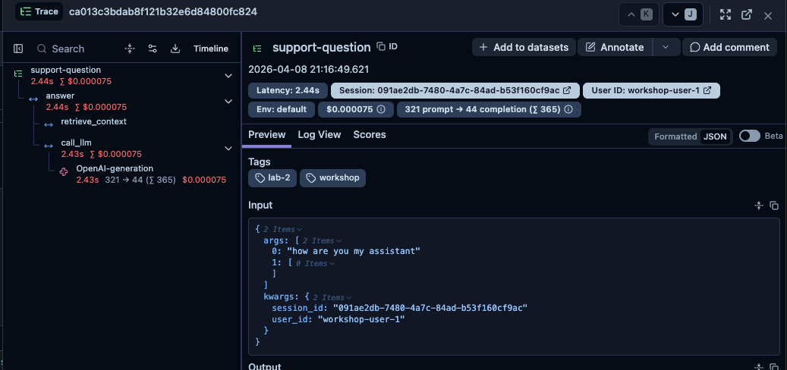

# Lab 2: Rich Instrumentation

## Concept

Basic tracing tells you *what* happened. Rich instrumentation tells you *who*, *how much*, and *why*.

In production, you need to answer questions like:
- Which user triggered this trace? (user tracking)
- Was this part of a multi-turn conversation? (sessions)
- How many tokens did this cost? (usage tracking)
- What version of the app generated this? (release tracking)
- Why did this particular trace fail? (metadata)

Langfuse supports all of this through **trace attributes** and **propagated context**.

### Key concepts

| Concept | Purpose | Example |
|---------|---------|---------|
| `user_id` | Link traces to users | `"user_42"` |
| `session_id` | Group traces from one conversation | `"conv_abc123"` |
| `tags` | Filter traces in the UI | `["production", "v2"]` |
| `metadata` | Attach arbitrary data | `{"ab_variant": "A"}` |
| `usage_details` | Token counts for cost tracking | `{"input_tokens": 120, "output_tokens": 45}` |
| `version` | Track app/prompt versions | `"1.2.0"` |

---

## What You'll Build

Extend the instrumented assistant from Lab 1 to capture:
1. Token usage and model details on generations
2. Session IDs so multi-turn conversations group together
3. User IDs on every trace
4. Custom metadata and version tags

---

## Tasks

### Task 2.1 — Capture token usage on generations

Open `app/assistant.py`. The `client = OpenAI()` line at the top is where the OpenAI client is created. Currently it records input/output text but not token counts. Langfuse can display cost estimates, but only if it knows the token usage.

The simplest way to enable this is Langfuse's **drop-in OpenAI replacement** — a one-line import change that wraps the OpenAI client and automatically captures token usage, model name, and cost for every call, with no other code changes needed.

Replace the OpenAI import at the top of `app/assistant.py`:

```python
# Before
from openai import OpenAI

# After
from langfuse.openai import OpenAI
```

That's it. The `call_llm()` function stays exactly as it is. Langfuse intercepts every `client.chat.completions.create()` call and records the model, token counts, and estimated cost automatically.

> **Note**: Because the OpenAI wrapper now creates the generation observation automatically, also change `@observe(as_type="generation")` on `call_llm()` to plain `@observe()`. Keeping `as_type="generation"` would create a generation nested inside another generation. With the wrapper, `call_llm` becomes a regular span and the OpenAI call inside it becomes the generation.

Ask a question and open the trace in Langfuse. Click into the generation node — you should now see rich metadata that wasn't there in Lab 1:



Notice what the OpenAI wrapper added automatically: the **model name**, **token counts** (input, output, total) in the top bar, and an estimated **cost in USD**. The Input section shows the exact messages array sent to the model and the Output shows the response — the same as before, but now with the cost data attached.

> **Other model providers**: Langfuse offers the same drop-in integration pattern for most major providers and frameworks — not just OpenAI. For example:
> - **Anthropic** *(interesting one)*: Anthropic exposes an OpenAI-compatible API, so you can reuse the exact same `from langfuse.openai import OpenAI` wrapper — just swap the `api_key`, `base_url`, and model name:
>   ```python
>   from langfuse.openai import OpenAI
>
>   client = OpenAI(
>       api_key="sk-ant-...",                        # Anthropic API key
>       base_url="https://api.anthropic.com/v1/",    # Anthropic endpoint
>   )
>   response = client.chat.completions.create(
>       model="claude-opus-4-20250514",
>       messages=[...],
>   )
>   ```
>   No new SDK, no new integration — the same wrapper, three config changes.
> - **AWS Bedrock**: wrap calls using the `@observe()` decorator with manual usage reporting
> - **Google Gemini / Vertex AI**: native Langfuse integrations available
> - **LiteLLM**: `litellm.callbacks = ["langfuse_otel"]` — one line to trace any of the 100+ models LiteLLM supports (Mistral, Groq, Cohere, Ollama, etc.)
> - **LangChain / LangGraph**: pass `CallbackHandler` from `langfuse.callback`
> - **LlamaIndex**: register the Langfuse handler once at startup
>
> The full list is at [langfuse.com/integrations](https://langfuse.com/integrations). For this workshop we use OpenAI directly, but the observability patterns you're learning apply identically across all of them.

---

### Task 2.2 — Add session tracking

Right now each question creates an independent trace. But your app supports multi-turn conversations — logically, all turns of a conversation should be grouped.

Langfuse uses a `session_id` for this. Pass it via `propagate_attributes`:

```python
import uuid
from langfuse import observe, propagate_attributes

@observe()
def answer(question: str, history: list[dict] | None = None, session_id: str | None = None) -> str:
    with propagate_attributes(session_id=session_id or str(uuid.uuid4())):
        context = retrieve_context(question)
        ...
```

Update `app/main.py` to generate a session ID at startup and pass it through:

```python
import uuid
session_id = str(uuid.uuid4())

# In the loop:
response = answer(question, history, session_id=session_id)
```

Ask a few questions in one session. In Langfuse, go to **Sessions** — all questions from that run should be grouped together.



The session view shows every conversation turn in order, each with its own Input and Output. This is what a support team would use to replay an entire customer conversation — every question asked, every answer given, in sequence. Without session tracking, these would appear as unrelated individual traces with no way to connect them.

---

### Task 2.3 — Add user ID and trace metadata

In a real app you'd have authenticated users. Simulate this by hardcoding a user ID and passing it as trace metadata:

```python
from langfuse import observe, propagate_attributes

@observe()
def answer(question: str, history: list[dict] | None = None, session_id: str | None = None, user_id: str | None = None) -> str:
    with propagate_attributes(
        session_id=session_id,
        user_id=user_id,
        tags=["workshop", "lab-2"],
        metadata={"app_version": "1.0.0"},
    ):
        ...
```

Update `app/main.py` to pass a `user_id` (e.g., `"workshop-user-1"`).

After running the app, go to **Observability → Users** in Langfuse. You'll see your user appear with their first and last event timestamps and a total trace count.



In production, each of your actual users would appear here. You can click a user to see all their traces, filter by user to debug a specific complaint, or track how frequently a user is interacting with your app. This is the starting point for understanding the per-user experience.

---

### Task 2.4 — Name your traces

By default, traces use the function name. Give the root trace a meaningful name using `trace_name`:

```python
with propagate_attributes(
    trace_name="support-question",
    session_id=session_id,
    user_id=user_id,
):
    ...
```

Ask a question and open the trace. The name `support-question` now appears at the top of the trace detail dialog instead of `answer`.



This matters at scale — when you have thousands of traces from different features or pipelines, a meaningful name lets you filter and identify them instantly rather than guessing from function names.

---

### Task 2.5 — Separate environments

In production you'll have development, staging, and production data all flowing into the same Langfuse project. Without environments they all mix together.

Add one line to your `.env` file:

```bash
LANGFUSE_TRACING_ENVIRONMENT=development
```

That's it — Langfuse picks it up automatically. Every trace you send now carries an `environment` attribute.

In the Langfuse UI, use the **Environment** filter (top of the Traces table) to show only `development` traces. When you deploy to production you'd set `LANGFUSE_TRACING_ENVIRONMENT=production` there and the two data streams stay completely separate — same project, same prompts, same datasets, different views.

> This is a one-line change that saves a lot of confusion when you start running the same app in multiple environments.

---

## Checkpoint

Ask several questions across a session. In Langfuse:

- [ ] Generations show token counts (input + output)
- [ ] Generations show the model name
- [ ] Traces are grouped under a Session in the Sessions view
- [ ] Traces show `user_id` and `tags` in the detail view
- [ ] Traces are named `"support-question"` instead of `"answer"`
- [ ] Traces are filterable by `environment = development` in the Traces table

---

## Why This Matters

With user IDs and sessions, you can:
- Filter all traces for a specific user who reported a bug
- See the full conversation history for a support case
- Measure per-user token spend
- Identify users having bad experiences

With token usage, you can:
- Build cost dashboards (cost per user, per feature, per day)
- Set budget alerts
- Compare cost across model versions

---

## Solution

See [`solution/assistant.py`](./solution/assistant.py) for the instrumented assistant and [`solution/main.py`](./solution/main.py) for the updated entry point.
