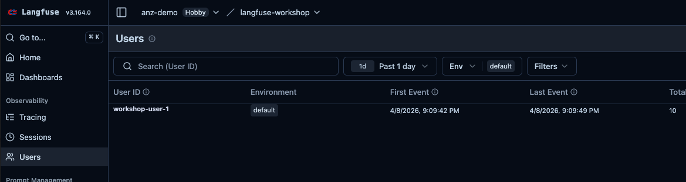
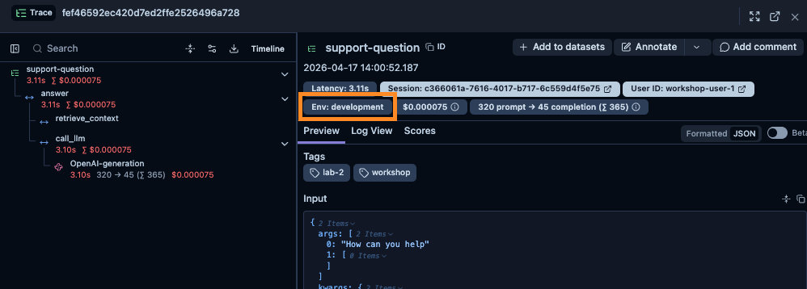

# Lab 3: Sessions & Environments

## Concept

Lab 2 gave us rich tracing — nested observations, costs, tokens, latency, a meaningful trace name. That's enough to see *what* the app did. To see **who** it did it for and **where** the traffic came from, we need two more attributes:

| Concept | Purpose | Example |
|---------|---------|---------|
| `session_id` | Group traces from one conversation | `"conv_abc123"` |
| `user_id` | Link traces to a user | `"user_42"` |
| `environment` | Separate dev / staging / production streams | `"development"` |

Without these, a 10-turn conversation appears as 10 unrelated traces, and your production dashboards mix dev test traffic with real users.

---

## What You'll Build

Extend the instrumented assistant from Lab 2 to capture:

1. Session IDs so multi-turn conversations group together, plus user IDs on every trace
2. An environment attribute so dev, staging, and production data stay separate in the same Langfuse project

---

## Tasks

### Task 3.1 — Add session and user tracking

Right now each question creates an independent trace. But your app supports multi-turn conversations — logically, all turns of a conversation should be grouped. And in a real app you'd have authenticated users; you'd want to filter traces by user when investigating a complaint.

Langfuse handles both with `session_id` and `user_id`. Pass them via `propagate_attributes` and they automatically apply to the current trace **and** every child observation.

**File: `app/assistant.py`** — add `uuid` and `propagate_attributes` to the imports, then update `answer()`:

```python
# Add to imports at the top:
import uuid
from langfuse import observe, propagate_attributes

@observe(name="support-question")
def answer(
    question: str,
    history: list[dict] | None = None,
    session_id: str | None = None,
    user_id: str | None = None,
) -> str:
    with propagate_attributes(
        session_id=session_id or str(uuid.uuid4()),
        user_id=user_id,
    ):
        context = retrieve_context(question)

        messages = [{"role": "system", "content": SYSTEM_PROMPT}]
        if history:
            messages.extend(history)
        messages.append({
            "role": "user",
            "content": f"Documentation context:\n{context}\n\nQuestion: {question}"
        })

        return call_llm(messages)
```

> **Web app**: once `answer()` accepts `session_id` and `user_id`, `app/web.py` passes them automatically — no changes to `web.py` needed. Each browser tab gets its own session ID; the user ID is hard-coded to `workshop-user-1`.

Ask a few questions in one session. In Langfuse, go to **Sessions** — all questions from that run should be grouped together.


The session view shows every conversation turn in order, each with its own Input and Output. This is what a support team would use to replay an entire customer conversation — every question asked, every answer given, in sequence. Without session tracking, these would appear as unrelated individual traces with no way to connect them.

Now go to **Observability → Users** in Langfuse. `workshop-user-1` should appear with their first and last event timestamps and a total trace count.



In production, each of your actual users would appear here. You can click a user to see all their traces, filter by user to debug a specific complaint, or track how frequently a user is interacting with your app.

---

### Task 3.2 — Separate environments

In production you'll have development, staging, and production data all flowing into the same Langfuse project. Without environments they all mix together — and your dashboards end up averaging real users with developer test runs.

Add one line to your `.env` file (it's already in `.env.example`):

```bash
LANGFUSE_TRACING_ENVIRONMENT=development
```

That's it — no code change. Langfuse picks the env var up automatically and every trace you send now carries an `environment` attribute.

In the Langfuse UI, use the **Environment** filter (top of the Traces table) to show only `development` traces. When you deploy to production you'd set `LANGFUSE_TRACING_ENVIRONMENT=production` there and the two data streams stay completely separate — same project, same prompts, same datasets, different views.



> One env-var change saves a lot of confusion when you start running the same app in multiple environments.

---

## Checkpoint

Ask several questions across a session. In Langfuse:

- [ ] Traces are grouped under a Session in the Sessions view
- [ ] `workshop-user-1` appears in the Users view
- [ ] Traces are filterable by `environment = development` in the Traces table

---

## Why This Matters

With session, user, and environment attached to every trace, you can:

- Filter all traces for a specific user who reported a bug
- See the full conversation history for a support case
- Measure per-user token spend
- Keep dev traffic out of production dashboards and evaluators

This is the smallest amount of context you need before scores and evals (Lab 5+) start making sense at scale.

---

## Solution

See [`solution/assistant.py`](./solution/assistant.py) for the instrumented assistant.
