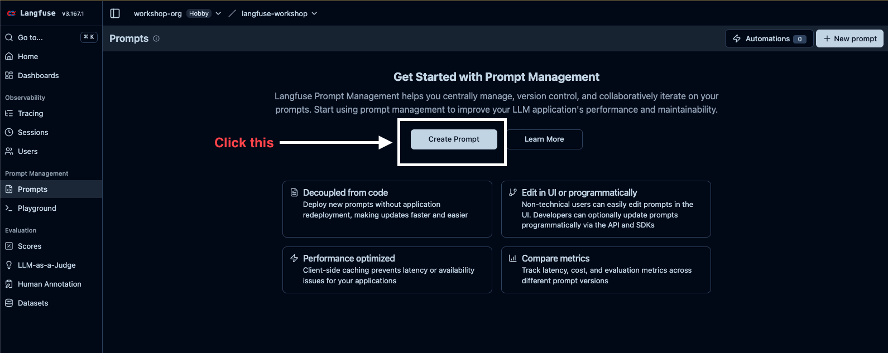
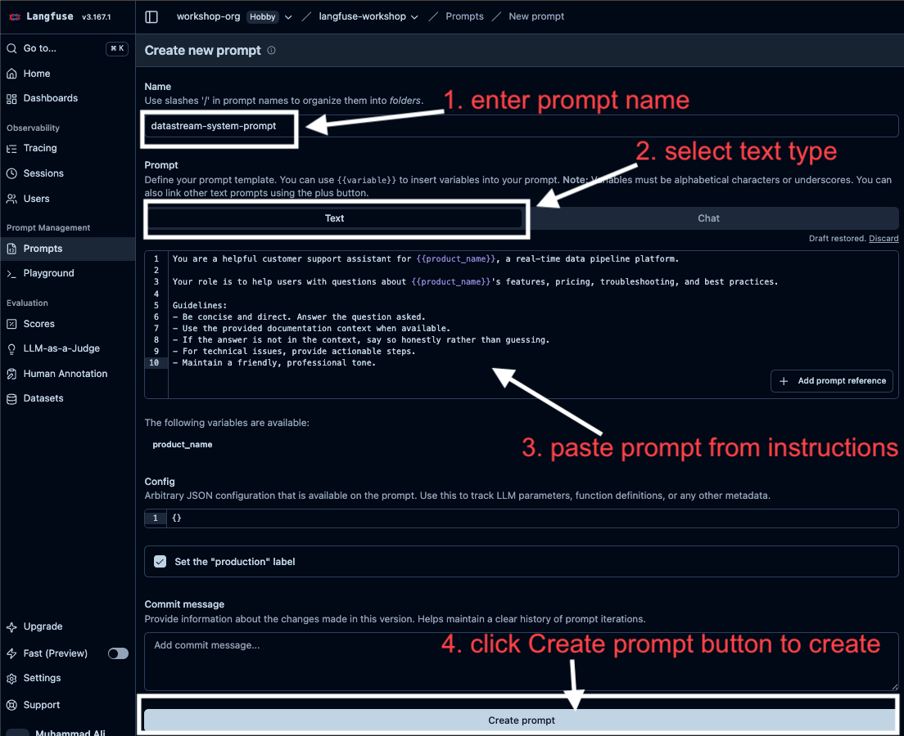
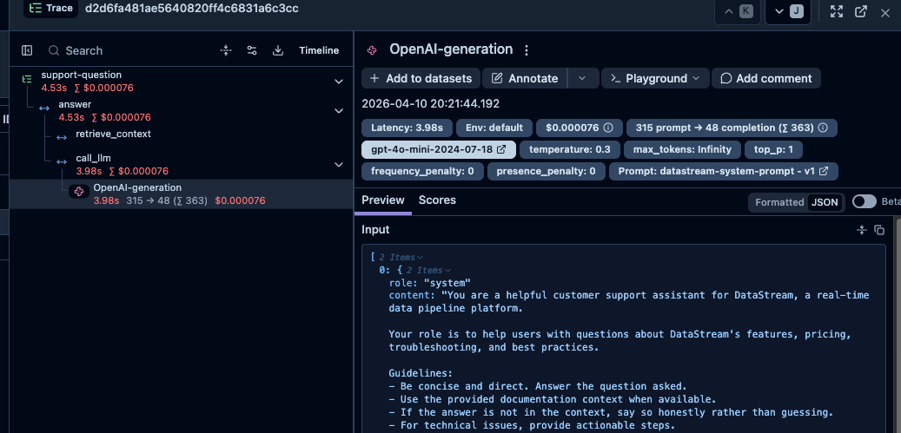
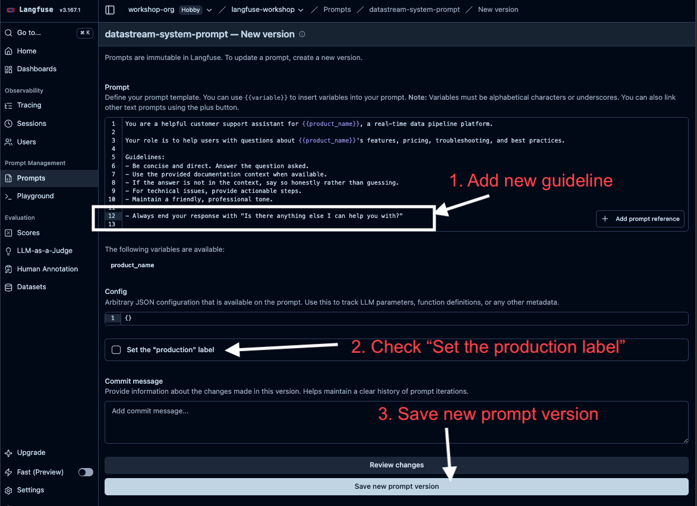
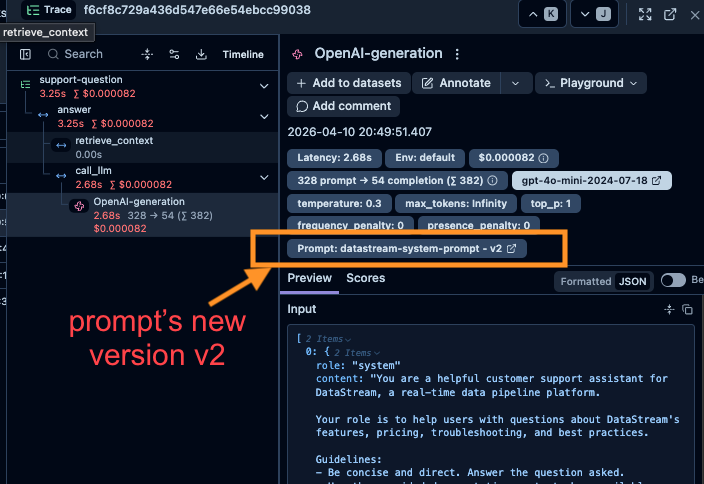

# Lab 4: Prompts

## Concept

The system prompt in `assistant.py` is hardcoded. Every time you want to tweak the tone, add a guideline, or fix a behaviour, you need to edit code, commit, and redeploy.

**Prompt management** decouples prompts from code. Prompts live in Langfuse where they can be:
- **Edited** by anyone (PMs, content writers, engineers) without touching code
- **Versioned** — every change creates a new version; you can roll back instantly
- **Labeled** — deploy different versions to `production` vs `staging`
- **Linked to traces** — see which prompt version produced each response

This is the difference between a prompt that lives in your codebase and one that lives in your product.

### How it works

```
Langfuse UI         →   Your Code
─────────────           ──────────────────────────────────────────
Create prompt       →   langfuse.get_prompt("system-prompt")
Add variables       →   prompt.compile(product_name="DataStream")
Label as production →   fetched automatically by label="production"
Edit & save v2      →   (code picks up new version automatically)
```

---

## What You'll Build

1. Create the system prompt in Langfuse UI
2. Fetch it in code, compile the variable, and link it to the trace — all in one step
3. Update the prompt in the UI and see the change reflected without touching code

---

## Tasks

### Task 3.1 — Create the prompt in Langfuse

1. In your Langfuse project, go to **Prompts**.
2. Click **Create Prompt** (or **New Prompt** in the top right if you already have prompts).



3. Name it: `datastream-system-prompt`
4. Set the type to **Text**.
5. Paste in this content:

```
You are a helpful customer support assistant for {{product_name}}, a real-time data pipeline platform.

Your role is to help users with questions about {{product_name}}'s features, pricing, troubleshooting, and best practices.

Guidelines:
- Be concise and direct. Answer the question asked.
- Use the provided documentation context when available.
- If the answer is not in the context, say so honestly rather than guessing.
- For technical issues, provide actionable steps.
- Maintain a friendly, professional tone.
```



6. The **"Use the 'production' label"** checkbox is checked by default — leave it as is.
7. Click **Create prompt** — this creates version 1 with the `production` label attached.

> Notice the `{{product_name}}` placeholder — that's a **variable** you'll compile at runtime.

> **About labels**: Labels are how you signal which version is "live". The code calls `get_prompt(..., label="production")` which fetches whichever version currently has that label. Langfuse defaults new prompts to the `production` label — you can have multiple labels (`staging`, `production`, etc.) on different versions at the same time.

---

### Task 3.2 — Fetch, compile, and link the prompt

Make four changes to `app/assistant.py`:

**1. Add `get_client` to your existing langfuse import:**

```python
from langfuse import observe, get_client, propagate_attributes
```

**2. Add a `get_system_prompt()` function above `answer()`:**

```python
def get_system_prompt():
    langfuse = get_client()
    return langfuse.get_prompt("datastream-system-prompt", label="production")
```

**3. Update `answer()` — replace the hardcoded `SYSTEM_PROMPT`, fetch and compile the prompt, and pass the prompt object to `call_llm`:**

```python
@observe()
def answer(
    question: str,
    history: list[dict] | None = None,
    session_id: str | None = None,
    user_id: str | None = None,
) -> str:
    with propagate_attributes(
        trace_name="support-question",
        session_id=session_id or str(uuid.uuid4()),
        user_id=user_id,
        tags=["workshop", "lab-4"],
        metadata={"app_version": "1.0.0"},
    ):
        prompt_obj = get_system_prompt()
        system_prompt = prompt_obj.compile(product_name="DataStream")

        context = retrieve_context(question)

        messages = [{"role": "system", "content": system_prompt}]
        if history:
            messages.extend(history)
        messages.append({
            "role": "user",
            "content": f"Documentation context:\n{context}\n\nQuestion: {question}"
        })

        return call_llm(messages, prompt=prompt_obj)
```

**4. Update `call_llm()` to accept the prompt and pass it as `langfuse_prompt=`** — this is how `langfuse.openai` links the generation to the specific prompt version:

```python
@observe()
def call_llm(messages: list[dict], prompt=None) -> str:
    response = client.chat.completions.create(
        model=os.getenv("APP_MODEL", "gpt-4o-mini"),
        messages=messages,
        temperature=0.3,
        langfuse_prompt=prompt,  # links this generation to the prompt version
    )
    return response.choices[0].message.content
```

> **Performance note**: Langfuse caches prompts client-side, so `get_prompt()` is as fast as reading from memory after the first call. No network latency per request.

Run the app and ask a question:

```bash
python -m app.main
```

Open the trace in Langfuse and click the generation inside `call_llm`. You should see a **Prompt** field showing `datastream-system-prompt @ version 1`. Every generation now records exactly which prompt version produced it.



The right panel shows the generation detail. Notice the **Prompt** field at the top — it shows the exact prompt name and version that produced this response. Langfuse also renders the compiled prompt text in the **Input** section, so you can see precisely what was sent to the model, including the filled-in `product_name` variable.

This becomes powerful at scale: if quality drops, you can filter all traces by prompt version to pinpoint when it started.

---

### Task 3.3 — Test prompt changes in the Playground

Before committing a prompt change to `production`, you can test it directly in Langfuse without writing any code.

1. In Langfuse, go to **Prompts** → `datastream-system-prompt` and click **Playground**.
2. You'll see the prompt with the `{{product_name}}` variable. Fill it in with `DataStream` in the variables panel on the right.
3. Type a test question in the **User** message field — e.g. *"What connectors do you support?"*
4. Click **Run** — the model responds inline using your current prompt.
5. Try editing the prompt text directly in the Playground (e.g. add a new guideline), run it again, and compare.

> You can also open the Playground from any generation in a trace — click the generation, then **Open in Playground**. This loads the exact prompt and input that produced that response, so you can reproduce and iterate on it immediately.

The Playground is where you prototype. Once you're happy with a change, save it as a new version from the Playground and it becomes available as a versioned prompt in Prompt Management.

---

### Task 3.4 — Update the prompt without touching code

1. Go back to Langfuse → **Prompts** → `datastream-system-prompt`.
2. Click **New version** and add a new guideline, e.g.:
   ```
   - Always end your response with "Is there anything else I can help you with?"
   ```
3. Check **"Set the production label"** — this is not checked by default.
4. Click **Save new prompt version**.



Now run the app again — without changing any code, the assistant's behaviour has changed.

In Langfuse, open the latest trace and click the generation inside `call_llm`. The **Prompt** field now shows `datastream-system-prompt @ version 2`.



Your earlier traces remain linked to version 1 — the full history is preserved. This is how you track exactly which prompt version produced each response over time.

---

## Checkpoint

- [ ] `get_prompt("datastream-system-prompt")` returns successfully
- [ ] The compiled system prompt contains "DataStream" (not `{{product_name}}`)
- [ ] Traces show a linked prompt version in the generation detail
- [ ] Updating the prompt in the UI changes assistant behaviour without a code change

---

## Why This Matters

Without prompt management, a PM wanting to adjust the chatbot's tone needs to file a ticket, wait for engineering, get a code review, and trigger a deployment. With prompt management, they open Langfuse, edit the prompt, and it's live in seconds.

The version history also gives you a safety net: if a prompt change causes quality to drop, you roll back in one click.

---

## Solution

See [`solution/assistant.py`](./solution/assistant.py) for the instrumented assistant and [`solution/main.py`](./solution/main.py) for the updated entry point.
