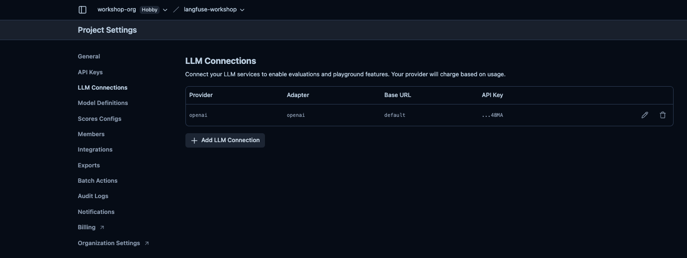
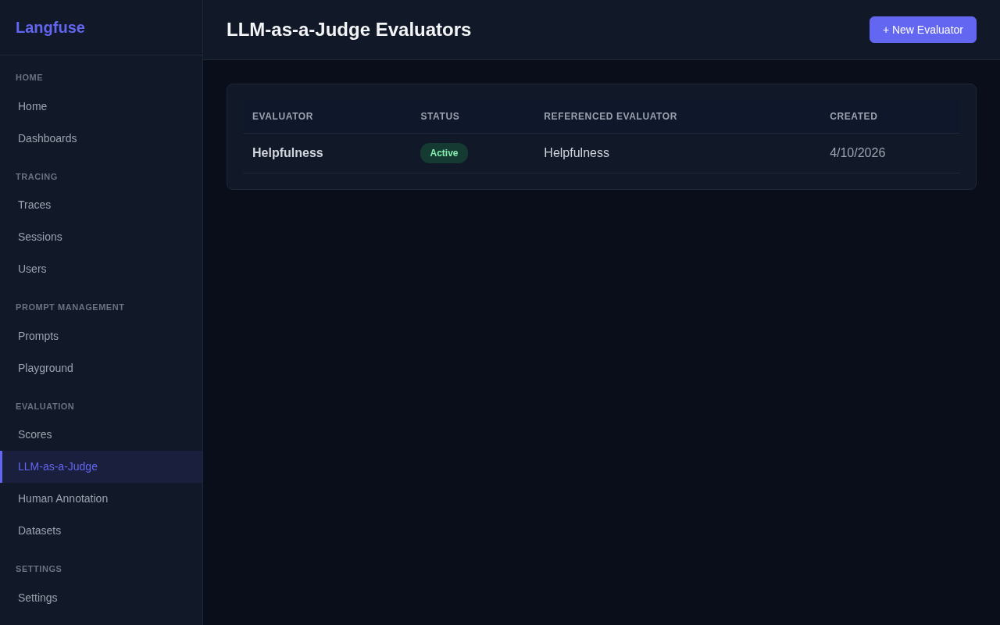
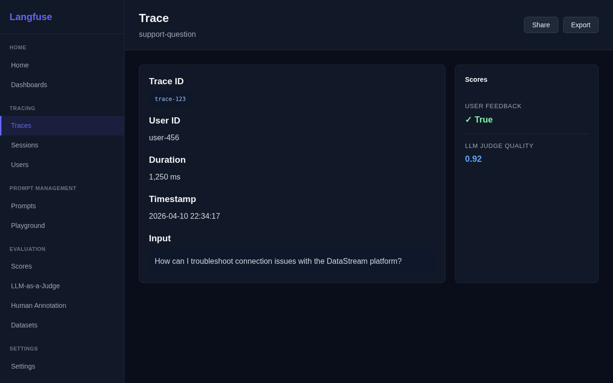
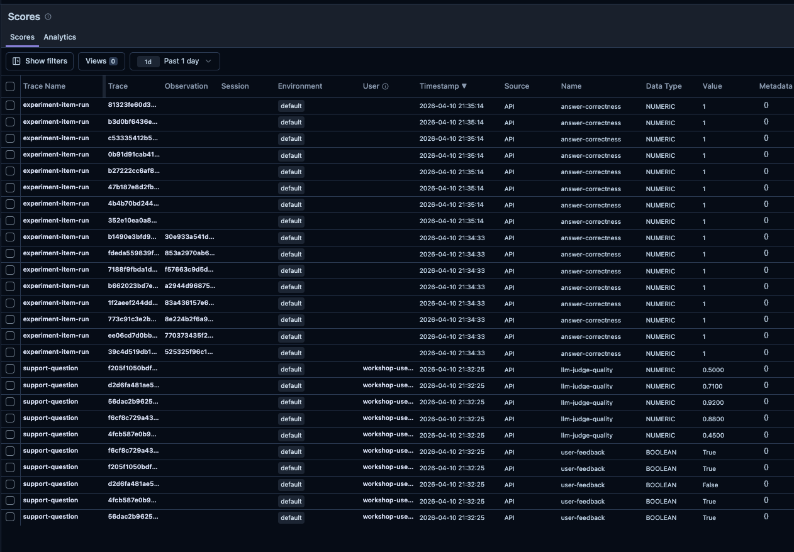

# Lab 5: Online Evals

## Concept

Traces show you *what* your LLM did. Scores tell you *how well* it did.

Without evaluation, you're flying blind: you can't tell if a model upgrade improved quality, if a prompt change broke something, or which users are getting bad responses. **Scores** attach a quality signal to traces and observations, enabling data-driven decisions.

Langfuse supports three score collection methods:

| Method | When to use |
|--------|-------------|
| **SDK scores** | Programmatic evaluation — run after every request |
| **User feedback** | Capture thumbs up/down from end users |
| **Human annotation** | Manual review queues for spot-checking or labeling |

Scores can be:
- **Numeric** (0.0–1.0): continuous quality metrics
- **Boolean** (true/false): binary pass/fail
- **Categorical** (e.g., "good", "bad", "unsure"): labeled buckets

Once you have scores, you can filter traces by score, chart quality over time, and correlate scores with prompt versions, models, or users.

---

## What You'll Build

1. Add user feedback (thumbs up/down) as scores on traces
2. Configure a no-code Langfuse-hosted evaluator that scores traces automatically
3. Write a programmatic LLM-as-a-judge evaluator for custom scoring logic
4. View score analytics in the Langfuse dashboard

---

## Tasks

### Task 5.1 — Capture user feedback as scores

The goal: after each response, ask the user "was this helpful?" and record their answer as a score on the trace. Scores let you filter, chart, and act on quality signals in the Langfuse dashboard.

To attach a score to a trace you need the **trace ID**. You get it by calling `langfuse.get_current_trace_id()` inside the `@observe`-decorated `answer()` function and returning it to the caller.

**Step 1 — Return the trace ID from `answer()`**

Update `app/assistant.py` so `answer()` returns a `(response, trace_id)` tuple:

```python
from langfuse import observe, get_client, propagate_attributes

@observe()
def answer(
    question: str,
    history: list[dict] | None = None,
    session_id: str | None = None,
    user_id: str | None = None,
) -> tuple[str, str | None]:
    langfuse = get_client()

    with propagate_attributes(
        trace_name="support-question",
        session_id=session_id or str(uuid.uuid4()),
        user_id=user_id,
        tags=["workshop"],
        metadata={"app_version": "1.0.0"},
    ):
        prompt_obj = get_system_prompt()
        system_prompt = prompt_obj.compile(product_name="DataStream")

        context = retrieve_context(question)

        messages = [{"role": "system", "content": system_prompt}]
        if history:
            messages.extend(history)
        messages.append({
            "role": "user",
            "content": f"Documentation context:\n{context}\n\nQuestion: {question}"
        })

        response = call_llm(messages, prompt=prompt_obj)
        trace_id = langfuse.get_current_trace_id()  # capture before context exits

    return response, trace_id
```

**Step 2 — Collect feedback in `main.py` and record it as a score**

Update `app/main.py` to unpack the tuple and prompt for feedback:

```python
from langfuse import get_client

langfuse = get_client()

# Inside the chat loop, replace the answer() call:
with console.status("[dim]Thinking...[/dim]"):
    response, trace_id = answer(question, history, session_id=session_id, user_id=user_id)

console.print(f"\n[bold blue]Assistant[/bold blue]: {response}")

feedback = Prompt.ask(
    "[dim]Was this helpful?[/dim]",
    choices=["y", "n", "skip"],
    default="skip",
)

if feedback in ("y", "n") and trace_id:
    langfuse.create_score(
        trace_id=trace_id,
        name="user-feedback",
        value=1 if feedback == "y" else 0,
        data_type="BOOLEAN",
        comment="User thumbs up/down from CLI",
    )
```

Run the app, ask a question, and give feedback. In Langfuse → **Traces**, open the trace — you should see a `user-feedback` score attached to it.

---

### Task 5.2 — Set up a no-code LLM-as-a-judge evaluator in the UI

Langfuse has **built-in evaluators** — you configure them once in the UI and they run automatically on every matching trace, with no code needed. This is the fastest way to get a quality signal on all your traffic.

**Prerequisites**: Connect an LLM to your Langfuse project first:
1. Go to **Settings** → **LLM Connections** → **Add new LLM connection**
2. Select **OpenAI**, enter your OpenAI API key, click **Save**



**Create the evaluator**:
1. Go to **Evaluation** → **LLM-as-a-Judge** → **Create Evaluator**
2. Pick a managed evaluator — e.g. **Helpfulness** or **Hallucination**
3. Set the target to **Live Observations**, filter by `trace name = support-question`
4. Map variables: `input` → observation input, `output` → observation output
5. Set sampling to `100%` for the workshop, click **Execute**



Run the app and ask a few questions. After a short delay, open a trace — you'll see a score from the Langfuse-hosted evaluator attached automatically.

---

### Task 5.3 — Write a programmatic evaluator

The UI evaluator is great for standard dimensions, but sometimes you need **custom scoring logic** — domain-specific rubrics, multi-step checks, or evaluations that call your own services. For that, you write the evaluator in code.

Since Lab 4, we manage prompts in Langfuse — not hardcoded in source files. The evaluator prompt is no different: create it in Langfuse so you can iterate on the rubric without redeploying code.

**Step 1 — Create the evaluator prompt in Langfuse**

1. Go to **Prompts** → **New Prompt**
2. Name: `evaluator-prompt`, Type: **Text**
3. Paste this content:

```
You are evaluating the quality of a customer support response.

Question: {{question}}
Response: {{response}}

Rate the response on a scale of 0.0 to 1.0 based on:
- Accuracy: Is the information correct?
- Helpfulness: Does it actually answer the question?
- Clarity: Is it easy to understand?

Respond with only a JSON object: {"score": <float>, "reason": "<one sentence>"}
```

4. Set label `production` and click **Create prompt**

**Step 2 — Create `app/evaluator.py`**

```python
import json
import os
from openai import OpenAI
from langfuse import get_client

client = OpenAI()


def evaluate_response(trace_id: str, question: str, response: str) -> None:
    """Run LLM-as-a-judge evaluation and record the score."""
    langfuse = get_client()

    # Fetch the prompt from Langfuse — same pattern as Lab 4
    prompt_obj = langfuse.get_prompt("evaluator-prompt", label="production")
    prompt_text = prompt_obj.compile(question=question, response=response)

    result = client.chat.completions.create(
        model=os.getenv("APP_MODEL", "gpt-4o-mini"),
        messages=[{"role": "user", "content": prompt_text}],
        response_format={"type": "json_object"},
        temperature=0,
    )

    evaluation = json.loads(result.choices[0].message.content)

    langfuse.create_score(
        trace_id=trace_id,
        name="llm-judge-quality",
        value=float(evaluation["score"]),
        data_type="NUMERIC",
        comment=evaluation.get("reason", ""),
    )
```

**Step 3 — Call the evaluator from `main.py`**

Run it in a background thread so it doesn't add latency for the user:

```python
import threading
from app.evaluator import evaluate_response

# After getting the response and trace_id:
threading.Thread(
    target=evaluate_response,
    args=(trace_id, question, response),
    daemon=True,
).start()
```

> **Code vs UI evaluators**: The UI evaluator (Task 5.2) is zero-maintenance — Langfuse hosts and runs it, it auto-scales, and you update the rubric without a deployment. The code evaluator gives full control: custom prompts, any scoring logic, access to your own data. And because the prompt lives in Langfuse, you can still tune the rubric without touching code. In practice, teams use both — UI evaluators for standard quality dimensions, code evaluators for domain-specific checks.

---

### Task 5.4 — View score analytics

Now that you have scores flowing in from multiple sources, explore them in Langfuse:

1. Go to **Traces** and filter by `score name = "llm-judge-quality"` — see which traces scored low and read the judge's reasoning in the comment.
2. Go to **Scores** → **Analytics** to see score distributions over time.
3. Compare scores between different prompt versions (if you updated the prompt in Lab 4).

Open any trace — you'll see the `user-feedback` boolean, the `llm-judge-quality` numeric score from your code evaluator, and the Langfuse-hosted evaluator score all attached:



The **Scores** list gives you a full view across all traces:



---

## Checkpoint

Ask 5+ questions with mixed quality (simple questions, edge cases, questions the bot can't answer).

- [ ] User feedback (y/n) creates a `user-feedback` score on the trace
- [ ] A Langfuse-hosted evaluator is active and attaching scores automatically
- [ ] `app/evaluator.py` exists and `llm-judge-quality` scores appear on traces
- [ ] Low-scoring traces have a comment explaining why
- [ ] Score analytics show in the Langfuse dashboard

---

## Why This Matters

With scores, you can:
- **Catch regressions**: If a prompt change drops average quality from 0.85 to 0.70, you see it before users complain
- **Find failure modes**: Filter to traces with score < 0.5 and look for patterns
- **Measure improvements**: Compare quality scores before/after a model upgrade
- **Prioritize fixes**: Sort traces by score and fix the worst experiences first

---

## Solution

See [`solution/assistant.py`](./solution/assistant.py) for the updated assistant, [`solution/evaluator.py`](./solution/evaluator.py) for the LLM-as-a-judge evaluator, and [`solution/main.py`](./solution/main.py) for the updated entry point with feedback collection.

Next: **[Lab 6: Human Annotation](../06-human-annotation/README.md)**
