# Lab 5: Online Evals

## Concept

Online evals are how you **catch interesting signals from production traffic** — moments worth a human's attention — and then **track those signals over time** so you can tell whether quality is improving, drifting, or regressing.

Tracing shows *what* your LLM did. **Scores** tell you *how well* it did, attached to each trace so you can filter, chart, and act on them.

Langfuse supports three score collection methods:

| Method | When to use |
|--------|-------------|
| **User feedback** | Capture thumbs up/down from end users — highest signal |
| **UI-hosted evaluator** | No-code LLM-as-a-judge running in the background |
| **SDK evaluator** | Programmatic scoring with custom logic |

Scores can be:
- **Numeric** (0.0–1.0): continuous quality metrics
- **Boolean** (true/false): binary pass/fail
- **Categorical** (e.g., "good", "bad", "unsure"): labeled buckets

In this lab we'll wire all three so each production trace ends up with three signals — and the **disagreement between them** turns into the most useful filter you have.

---

## What You'll Build

A bot scoring pipeline that catches **out-of-scope requests** — questions your DataStream assistant wasn't designed to answer, like "what's the best pasta recipe?" or competitor-product questions. That's a real production signal: if 20% of traffic is off-topic, no prompt tweak fixes it — you have a routing problem.

1. Capture user feedback (👍 / 👎) as scores attached to the observation
2. Configure a no-code Langfuse-hosted evaluator that flags out-of-scope questions automatically
3. Write a programmatic LLM-as-a-judge that runs the same check in code
4. Find traces where user feedback and the judge disagree, and watch the score distribution over time

---

## Tasks

### Task 5.1 — Capture user feedback as scores

The goal: after each response, ask the user "was this helpful?" and record their answer as a score on the trace. User feedback is the highest-signal evaluation you can get — it comes from a human who actually had a need.

To attach a score to a specific observation you need both the **trace ID** and the **observation ID**. You get them by calling `langfuse.get_current_trace_id()` and `langfuse.get_current_observation_id()` inside the `@observe`-decorated `answer()` and returning them to the caller.

**Step 1 — Return the trace ID and observation ID from `answer()`**

**File: `app/assistant.py`** — update the import at the top to include `get_client`:

```python
from langfuse import observe, get_client, propagate_attributes
```

Then replace the entire `answer()` function with this:

```python
@observe(name="support-question")
def answer(
    question: str,
    history: list[dict] | None = None,
    session_id: str | None = None,
    user_id: str | None = None,
) -> tuple[str, str | None, str | None]:
    langfuse = get_client()

    with propagate_attributes(
        session_id=session_id or str(uuid.uuid4()),
        user_id=user_id,
    ):
        prompt_obj = get_system_prompt()
        system_prompt = prompt_obj.compile(product_name="DataStream")

        context = retrieve_context(question)

        messages = [{"role": "system", "content": system_prompt}]
        if history:
            messages.extend(history)
        messages.append({
            "role": "user",
            "content": f"Documentation context:\n{context}\n\nQuestion: {question}"
        })

        response = call_llm(messages, prompt=prompt_obj)
        trace_id = langfuse.get_current_trace_id()
        observation_id = langfuse.get_current_observation_id()

    return response, trace_id, observation_id
```

**Step 2 — Feedback is already wired in `app/web.py`**

No code changes needed for this step. The web UI has 👍/👎 buttons on every assistant message. Once `answer()` returns a `trace_id` and `observation_id` (Step 1 above), those buttons start recording `user-feedback` scores automatically.

Here is the relevant code already in `app/web.py` that handles the button clicks:

```python
def _handle_like(data: gr.LikeData, state: dict) -> None:
    trace_ids = state.get("trace_ids", [])
    observation_ids = state.get("observation_ids", [])
    idx = data.index if isinstance(data.index, int) else data.index[0]
    turn = idx // 2
    trace_id = trace_ids[turn] if turn < len(trace_ids) else None
    if not trace_id:
        return  # answer() doesn't return trace_id yet (Labs 0–4) — no-op
    observation_id = observation_ids[turn] if turn < len(observation_ids) else None
    from langfuse import get_client
    get_client().create_score(
        trace_id=trace_id,
        observation_id=observation_id,  # pins the score to the specific observation, not just the trace
        name="user-feedback",
        value=1 if data.liked else 0,
        data_type="BOOLEAN",
        comment="User thumbs up/down from web UI",
    )
```

`data.liked` is `True` for 👍 and `False` for 👎. The score is a **BOOLEAN** type with value `1` (liked) or `0` (disliked). Passing both `trace_id` and `observation_id` pins the score to the exact `support-question` observation — not just the trace as a whole — so it appears directly on the observation in the Langfuse UI.

Ask a question in the browser and click 👍 or 👎. In Langfuse → **Observations**, open the observation — you should see a `user-feedback` score attached to it.

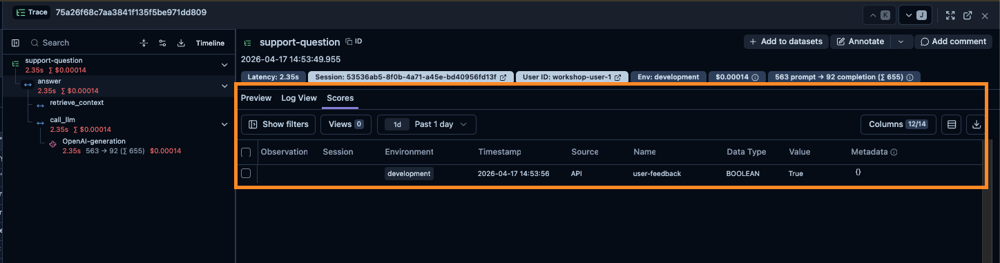

You can also filter observations by score value:

1. Expand the filter panel by clicking "Show filters" in the observations screen
2. Scroll down to "Numeric Scores" and select "user-feedback" equals 1.
3. The table will automatically show only observations where the user gave a thumbs up.

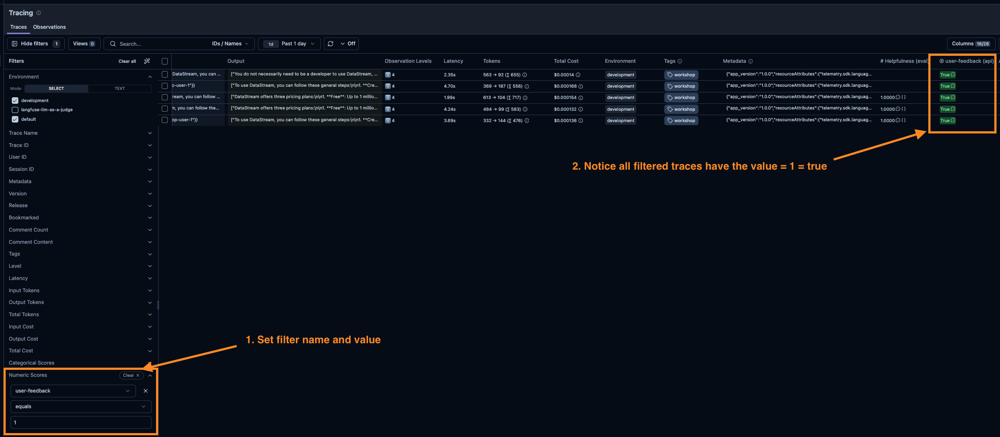

---

### Task 5.2 — Catch out-of-scope requests with a no-code UI evaluator

The assistant is built for DataStream questions — features, pricing, troubleshooting. When users ask about competitors, generic coding, or unrelated topics, that's an **out-of-scope** request: a production signal worth catching. If you see a lot of them, the problem isn't your prompt — it's where the traffic is coming from.

Langfuse has **built-in LLM-as-a-judge evaluators** — you configure them once in the UI and they run automatically on every matching trace, with no code needed. We'll create a custom one for out-of-scope detection.

**Prerequisites**: Connect an LLM to your Langfuse project first:

1. Go to **Settings** → **LLM Connections** → **Add new LLM connection**

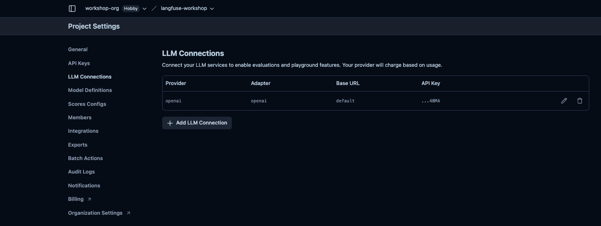

2. Select **OpenAI**, enter your OpenAI API key, click **Save**

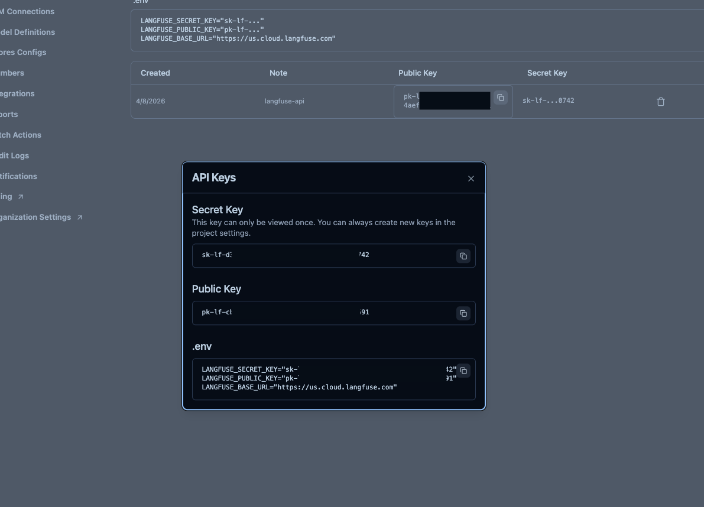

#### Create the evaluator

1. Go to **Evaluation** → **LLM-as-a-Judge** → **Create Evaluator**

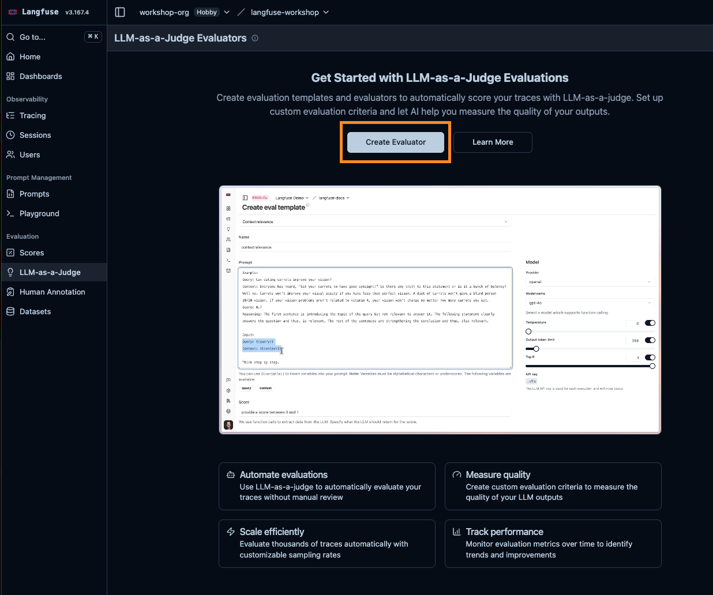

2. Choose **Custom** and name it `out-of-scope-check`. Paste this rubric:

```
You are checking whether a user question is in-scope for a customer
support assistant for DataStream — a real-time data pipeline platform.

In-scope: questions about DataStream features, pricing, connectors,
troubleshooting, security, billing, account setup.

Out-of-scope examples:
- Questions about competitors' products
- Generic coding help unrelated to DataStream
- Personal / off-topic chat
- Requests for opinions on unrelated topics

Question: {{input}}
Response: {{output}}

Reply with JSON only: {"in_scope": <true/false>, "reasoning": "<one sentence>"}.
Score 1 if in_scope is true, 0 if false.
```

3. Set **Run on** to **Observations**, add filters:
   - `trace name = support-question`
   - `environment = any of [development]` — limits evaluation to your dev traces only (use **any of**, not "none of")

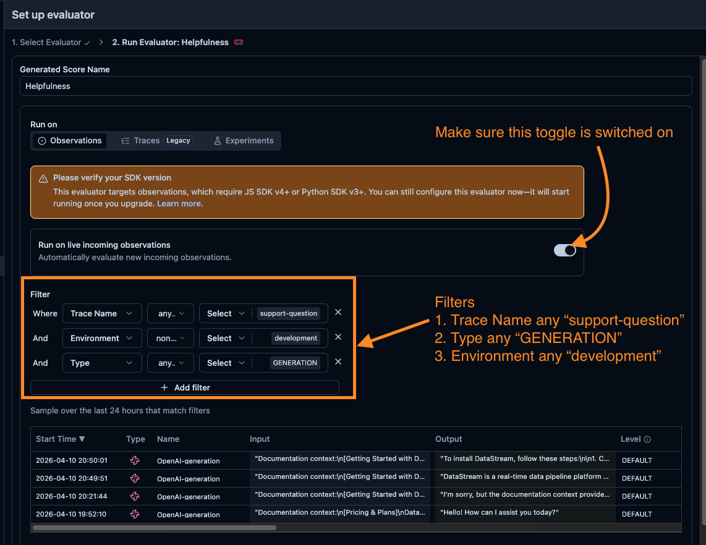

4. Map variables:
   - `input` → observation input, JsonPath: `$[1]["content"]` — selects the user's question (second message in the messages array)
   - `output` → observation output, JsonPath: `$["content"]` — selects the LLM's response text

   > **Important**: The double-quotes around `content` in `$["content"]` are required — write it exactly as shown or the path won't match.

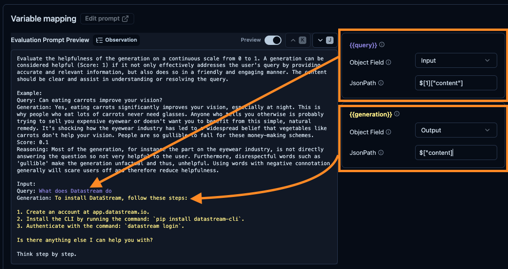

5. Set sampling to `100%` for the workshop (in production you'd sample). Click **Execute**. The evaluator should now show **Active**.

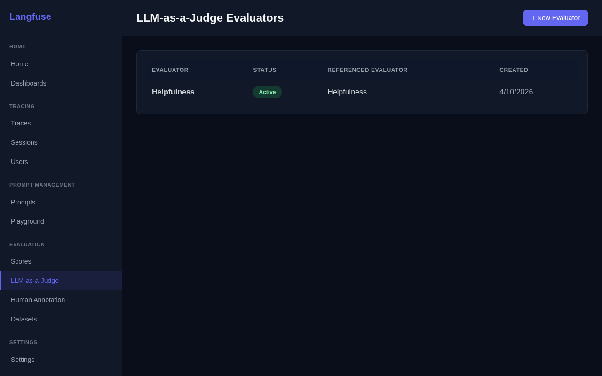

6. Go back to <a href="http://localhost:7860" target="_blank">http://localhost:7860</a> and ask a mix of questions:
   - **In-scope**: *"What does the Pro plan cost?"*, *"How do I configure a Kafka connector?"*
   - **Out-of-scope**: *"What's the best pasta recipe?"*, *"How do I set up Snowflake without DataStream?"*, *"What do you think of competitor X?"*

7. After 30–60 seconds, go to **Observations**, open an off-topic observation, and click the **Scores** tab. You should see `out-of-scope-check = 0` with the judge's reasoning in the comment.

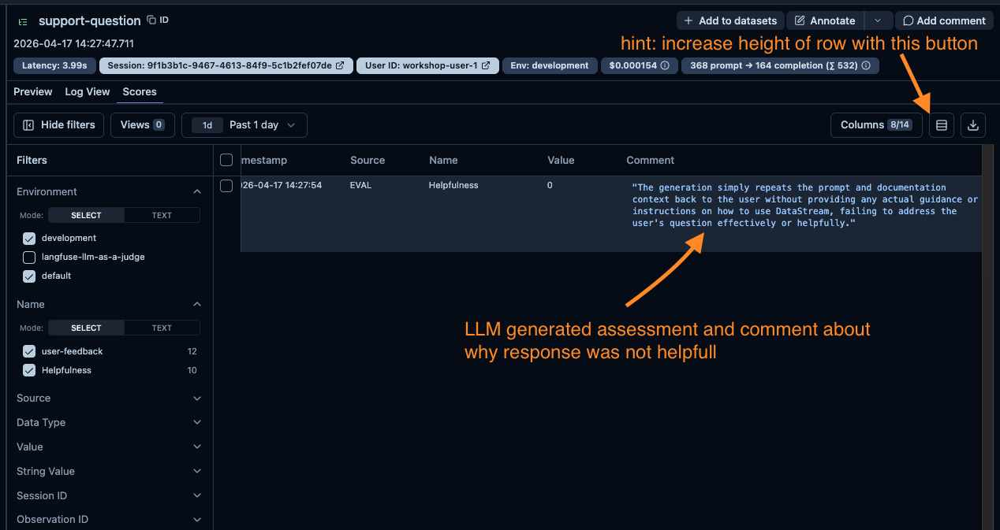

8. Now filter the observations table by `out-of-scope-check = 0` — you've just isolated every off-topic question that came through production.

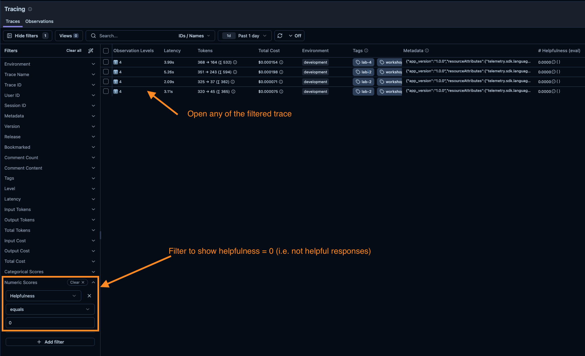

> This is the fastest way to get a quality signal on all of your traffic — no code, no deploy. The rubric lives in the UI; a PM can tighten the definition of "out of scope" without involving engineering.

---

### Task 5.3 — Write a programmatic evaluator (in-scope check via SDK)

The UI evaluator is great for standard cases. For full control — custom prompts, deterministic configs, calling your own services — you write the evaluator in code. Since Lab 4 we manage prompts in Langfuse so the rubric can be edited without redeploying; we'll do the same for the judge prompt.

**Step 1 — Create the evaluator prompt in Langfuse**

1. Go to **Prompts** → **New Prompt**
2. Name: `out-of-scope-evaluator-prompt`, Type: **Text**
3. Paste this content:

```
You are checking whether a user question is in-scope for a customer
support assistant for DataStream — a real-time data pipeline platform.

In-scope: questions about DataStream features, pricing, connectors,
troubleshooting, security, billing, account setup.

Out-of-scope examples:
- Questions about competitors' products
- Generic coding help unrelated to DataStream
- Personal / off-topic chat
- Requests for opinions on unrelated topics

Question: {{question}}
Response: {{response}}

Respond with only a JSON object:
{"in_scope": <true/false>, "reason": "<one sentence>"}
```

4. Set label `production` and click **Create prompt**

**Step 2 — Create a new file `app/evaluator.py`**

```python
# app/evaluator.py (create this file):
import json
import os
from openai import OpenAI
from langfuse import get_client

client = OpenAI()


def evaluate_response(trace_id: str, observation_id: str | None, question: str, response: str) -> None:
    """Score whether the question was in-scope and record the result on the trace."""
    langfuse = get_client()

    try:
        prompt_obj = langfuse.get_prompt("out-of-scope-evaluator-prompt", label="production")
        prompt_text = prompt_obj.compile(question=question, response=response)

        result = client.chat.completions.create(
            model=os.getenv("APP_MODEL", "gpt-4o-mini"),
            messages=[{"role": "user", "content": prompt_text}],
            response_format={"type": "json_object"},
            temperature=0,
        )

        evaluation = json.loads(result.choices[0].message.content)
        in_scope = bool(evaluation.get("in_scope", True))

        langfuse.create_score(
            trace_id=trace_id,
            observation_id=observation_id,
            name="in-scope",
            value=1 if in_scope else 0,
            data_type="BOOLEAN",
            comment=evaluation.get("reason", ""),
        )
    except Exception as e:
        print(f"Evaluation failed: {e}")
```

**Step 3 — Call the evaluator from `app/web.py`**

Add two lines inside `_submit()`, after `observation_ids = ...`:

```python
# app/web.py — add inside _submit():
if trace_id:
    import threading
    from app.evaluator import evaluate_response
    threading.Thread(
        target=evaluate_response,
        args=(trace_id, observation_id, message, response),
        daemon=True,
    ).start()
```

> **Why a background thread?** `evaluate_response` makes its own LLM call, which takes 1–2 seconds. Running it in a daemon thread means the user gets their response immediately — the evaluation happens in parallel.

> **Code vs UI evaluators**: The UI evaluator from Task 5.2 is zero-maintenance — Langfuse hosts and runs it, it auto-scales, and the rubric is editable in the UI. The code evaluator gives full control: custom logic, deterministic prompts, access to your own data. Because the prompt still lives in Langfuse, a non-engineer can keep tuning the rubric. Teams use both in practice — UI evaluators for standard signals, code evaluators for domain-specific checks.

The score we emit (`in-scope`) is the mirror of the UI evaluator's `out-of-scope-check` — both are BOOLEAN, both come from independent LLM judges with similar rubrics. In a real system you'd typically pick one; we're running both so you can see them side-by-side.

---

### Task 5.4 — Find disagreement and track quality over time

Three independent signals on every trace is the foundation. The interesting work starts when they **disagree**:

- **User 👍 but judge flagged out-of-scope** — judge was over-strict, or the user was happy in spite of the off-topic answer
- **User 👎 but judge says in-scope** — the question was on-topic but the answer was bad (the LLM is the problem, not the question)

These are the traces a human reviewer should look at first. To find them:

1. Go to **Observations** → open filters
2. Add: Numeric Scores → `user-feedback` = `1`
3. Add: Numeric Scores → `in-scope` = `0`
4. The remaining rows are the disagreement cases

That's the first half of online evals — **catching interesting signals from production.** The second half is **tracking quality over time**:

1. Go to **Scores → Analytics**
2. Look at the distribution of `in-scope` and `user-feedback` over time

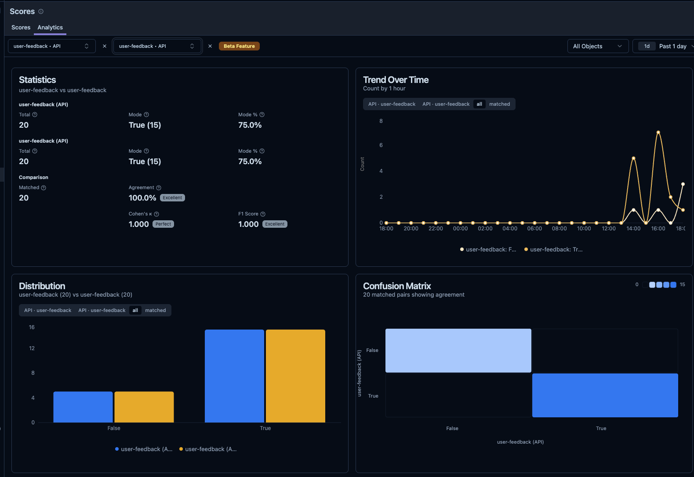

If your team has a clear definition of "good" — e.g. "≥90% of traffic is in-scope, ≥80% 👍" — this is where you watch it move. Without that opinion of what quality means, the charts are just numbers; with it, they become a dashboard you can act on.

Open any trace and you'll see all three scores attached:

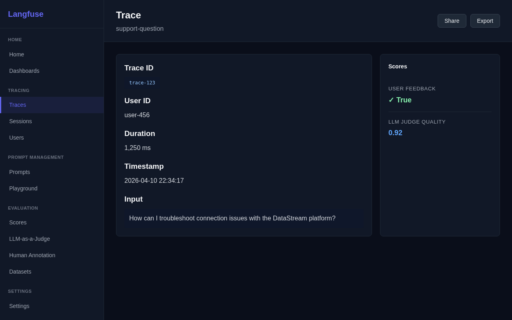

The **Scores** list gives you a full view across all traces:

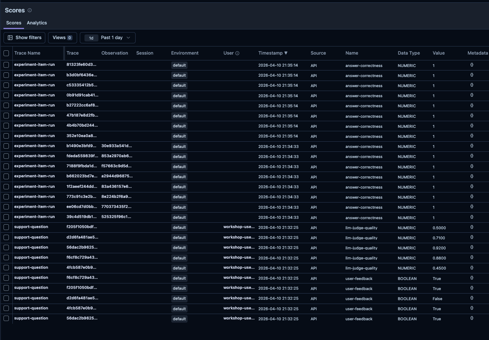

---

## Checkpoint

Ask 5+ questions with a mix of in-scope and out-of-scope inputs.

- [ ] Clicking 👍/👎 creates a `user-feedback` score on the observation
- [ ] The UI evaluator `out-of-scope-check` is active and scoring observations automatically
- [ ] `app/evaluator.py` exists and `in-scope` scores appear on observations
- [ ] Off-topic questions are flagged with `in_scope = 0` and a reason comment
- [ ] You can find at least one trace where the user thumb and the judge disagree

---

## Why This Matters

With these signals, you can:

- **Catch routing problems**: if 20% of traffic is off-topic, no prompt tweak fixes it — it's a routing/UX issue
- **Find the most interesting traces**: disagreement between user and judge is where reviewers should spend time
- **Track quality over time**: weekly score distributions show whether changes are helping or hurting
- **Prioritize fixes**: sort by score, look at the worst experiences first
- **Compare prompt versions**: average score before/after a prompt change tells you if it actually helped

---

## Solution

See [`solution/assistant.py`](./solution/assistant.py) for the updated assistant and [`solution/evaluator.py`](./solution/evaluator.py) for the SDK-based evaluator.

Next: **[Lab 6: Human Annotation](../06-human-annotation/README.md)**
