# Lab 6: Human Annotation

## Concept

Automated evaluators are fast and scalable, but they have blind spots. LLM judges can be confidently wrong, especially on domain-specific nuance, edge cases, or subtle quality issues. **Human annotation** is how you build ground truth.

In Langfuse, human annotation works at two levels:

| Level | When to use |
|-------|-------------|
| **Ad-hoc scoring** | Spot-check a single trace directly from the trace view |
| **Annotation queues** | Systematically review a batch of traces — route them to a queue and work through them one by one |

Human scores serve multiple purposes:
- **Ground truth** for calibrating your LLM-as-a-judge (is it agreeing with humans?)
- **Dataset curation** — traces you annotate as "bad" become test cases in Lab 7
- **Team collaboration** — share queues with domain experts, PMs, or QA reviewers who don't need to touch code

---

## What You'll Build

1. Create a Score Config defining your evaluation dimensions
2. Manually annotate traces directly in the UI
3. Create an Annotation Queue for systematic batch review
4. Work through the queue

---

## Tasks

### Task 6.1 — Create a Score Config

Score Configs define the dimensions you'll evaluate on — like a rubric. You need at least one before you can annotate.

1. Go to **Settings** → **Scores** → **+ Add score config**
2. Create two configs:

   **Config 1 — Response Quality**
   - Name: `response-quality`
   - Type: **Numeric** (range 1–5)
   - Description: *Overall quality of the response — accuracy, helpfulness, and clarity*

   **Config 2 — Answer Grounded**
   - Name: `answer-grounded`
   - Type: **Boolean**
   - Description: *Is the answer grounded in the provided documentation context?*

> Score Configs are reusable across all annotation workflows in the project — annotation queues, experiment reviews, and ad-hoc scoring all use the same configs.

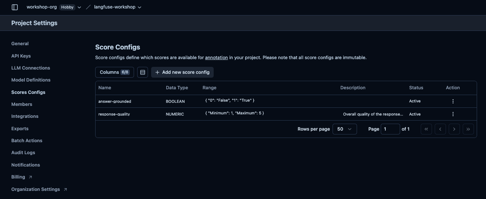

---

### Task 6.2 — Manually annotate a trace

1. Go to **Tracing** → **Traces** and open any trace from your recent runs.
_Note: Scores can also be attached to sessions, observations in addition to traces_ 

2. Click **Annotate** in the trace detail panel.

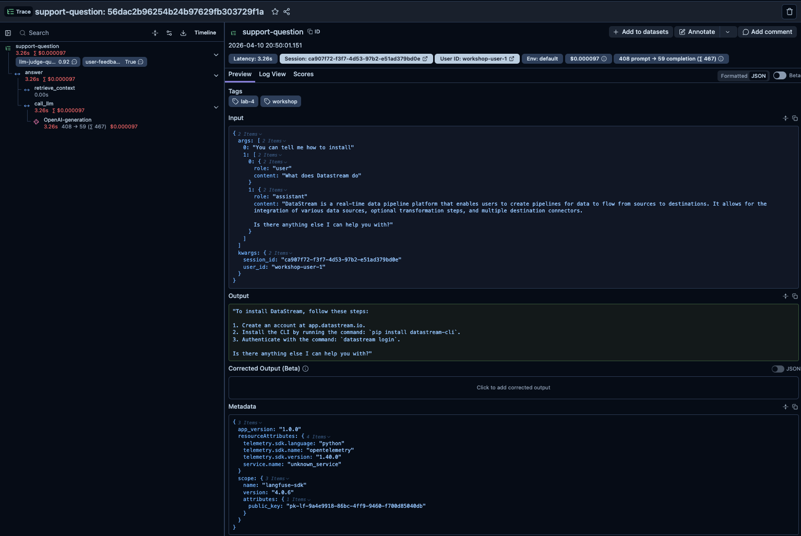

3. You'll see your Score Configs as annotation fields. Fill in:
   - `response-quality`: score 1–5
   - `answer-grounded`: true or false

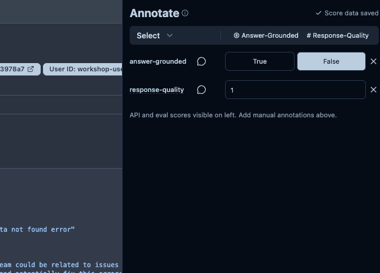
4. Optionally add a **comment** explaining your rating.

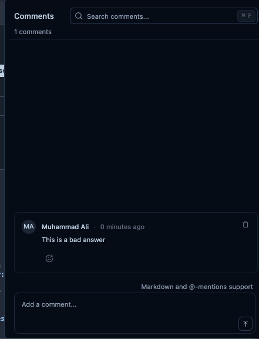

The scores are now attached to the trace and will appear in the Scores tab and in score analytics.

> Try annotating a trace you'd consider a failure (wrong answer, hallucinated content, off-topic response). Give it a low `response-quality` score. This is the start of your error analysis — you can later filter to low-scoring traces and add them to a dataset.

---

### Task 6.3 — Create an Annotation Queue and work through it

Ad-hoc annotation (Task 6.2) works for spot checks. When you want to review a batch systematically — "review all traces from the last session" — use an **Annotation Queue**. A queue lets you work through items one by one without losing your place, and multiple teammates can work the same queue simultaneously.

**Create the queue:**
1. Go to **Human Annotation** → **Annotation Queues** → **New Queue**
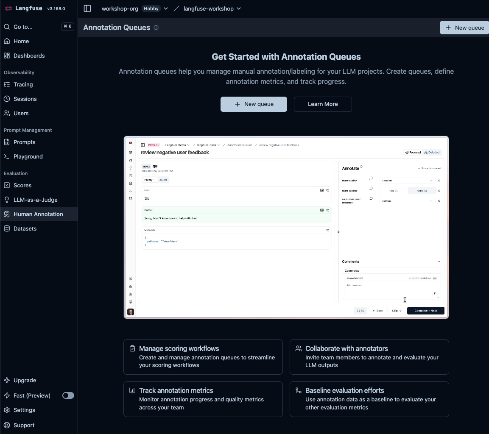

2. Name it: `workshop-review`
3. Select both Score Configs: `response-quality` and `answer-grounded`
4. Click **Create**

_Note: in a team setting, you can assign annotation queues to specific users_

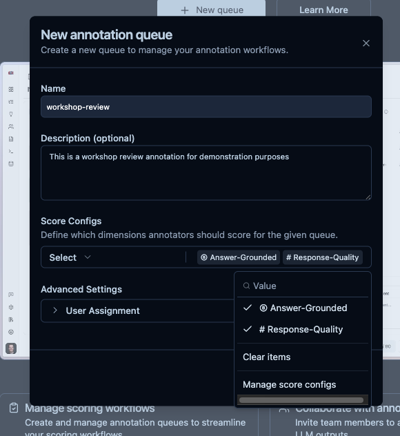

**Add traces to the queue:**
1. Go to **Tracing** → **Traces**

2. Select 5–10 traces using the checkboxes

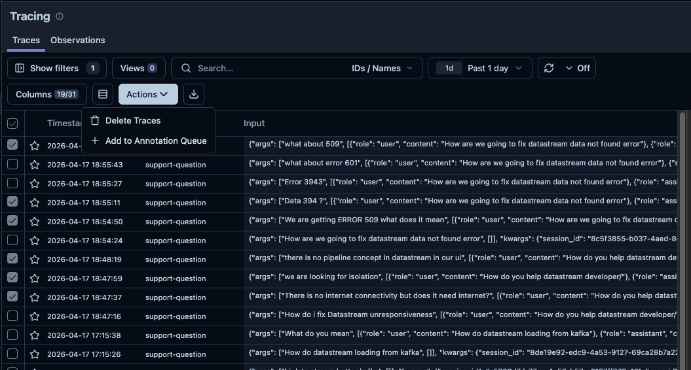

3. Click **Actions** → **Add to queue** → select `workshop-review`

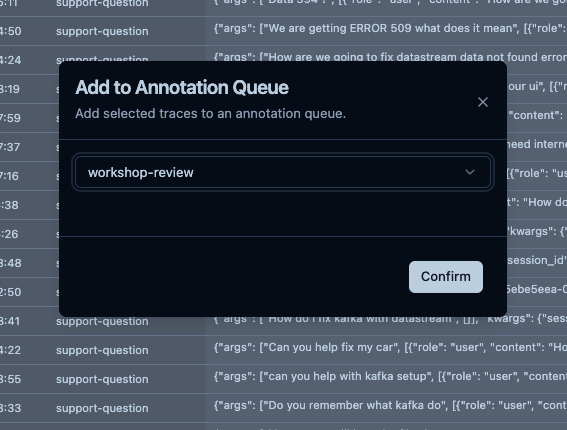

4. You should see a confirmation of addition.

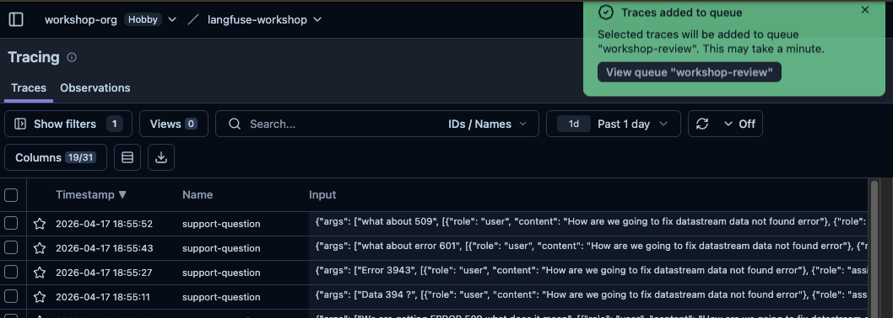

### **Work through the queue:**
1. Go to **Human Annotation** → **Annotation Queues** → `workshop-review`
2. You should see all the added traces in the queue. 

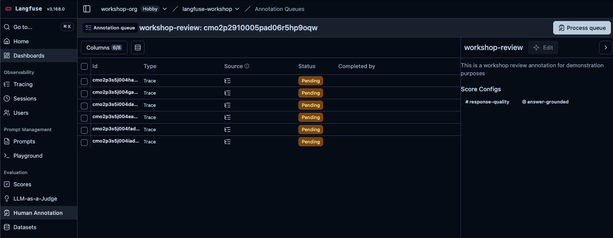

3. You can begin working on the queue by clicking **Process queue**

4. For each trace, review the input and output, then fill in your scores

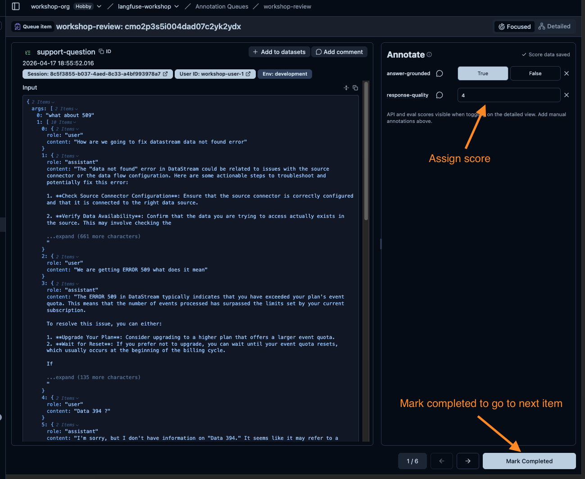

5. Importantly, you can choose to provide corrected output 

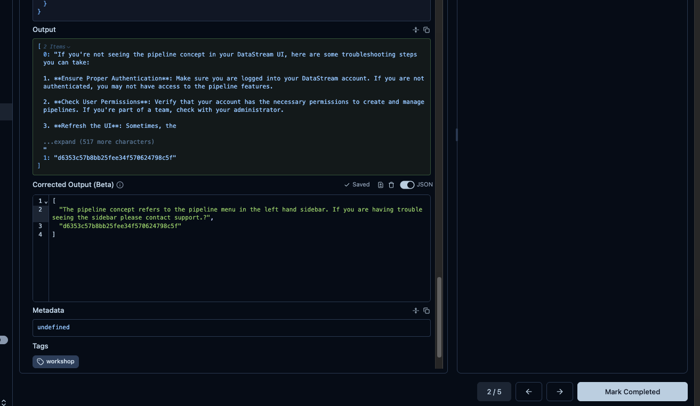

6. Click **Mark Completed** to move to the next item

The queue shows progress (X of Y completed) as you work through it.

> **Saving bad traces for later**: If you find a trace with a wrong or unhelpful response, remember that trace — in Lab 7 you'll add it to a dataset so it becomes a permanent test case.

---

## Checkpoint

- [ ] Two Score Configs exist: `response-quality` (numeric 1–5) and `answer-grounded` (boolean)
- [ ] At least one trace has manual annotation scores attached from Task 6.2
- [ ] `workshop-review` annotation queue exists with 5+ traces in it
- [ ] At least one queue item is marked completed

---

## Why This Matters

Human annotation is the calibration layer of your eval system. Without it:
- You don't know if your LLM judge is actually agreeing with humans
- You have no ground truth for domain-specific quality
- You can't identify what "bad" looks like in your specific context

With it, you can:
- Measure LLM judge agreement rate against humans and tune it if it's off
- Build a labeled dataset from production failures
- Give non-engineers a workflow to contribute to quality improvement

---

Next: **[Lab 7: Offline Evals — Datasets & Experiments](../07-offline-evals/README.md)**
