# Lab 7: Offline Evals — Datasets & Experiments

## Concept

Individual trace scores tell you how well a single response performed. But to make confident decisions about your system — "is prompt v2 better than v1?" — you need to run the same set of questions through both versions and compare.

**Datasets** are curated collections of input/expected-output pairs used as a benchmark. **Experiments** run your application against a dataset and record the results as traces, which you can then score and compare.

This is the foundation of **systematic evaluation**:

```
Dataset                     Experiment A (prompt v1)    Experiment B (prompt v2)
──────────────────          ────────────────────────    ────────────────────────
Q: "How do I get started?"  → response + score: 0.8     → response + score: 0.9
Q: "What does Pro cost?"    → response + score: 0.9     → response + score: 0.85
Q: "Why is my auth failing?"→ response + score: 0.6     → response + score: 0.8
                            avg: 0.77                   avg: 0.85 ✓ (use v2)
```

This replaces "I think the new prompt is better" with "the new prompt scores 10% higher on our benchmark."

---

## What You'll Build

1. Create a golden dataset of support questions with expected answers
2. Run a coded experiment against the dataset (LLM-as-a-judge scores each response)
3. Compare two prompt versions side by side in the Langfuse UI
4. Run a no-code experiment directly from the Langfuse UI
5. Add a production trace to the dataset to prevent that failure from ever regressing

---

## Tasks

### Task 7.1 — Create a dataset

A dataset is a curated collection of `(input, expected_output)` pairs — your benchmark. 

### **Create new dataset:**
1. Go to **Datasets** → **New dataset**
2. You should see a dialog to provide dataset name and description. Leave everything else as default

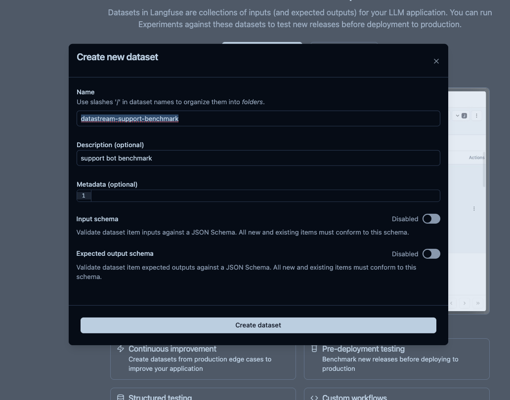

3. Click the newly created dataset **datastream-support-benchmark**

4. Go to items tab and click **Add manually**
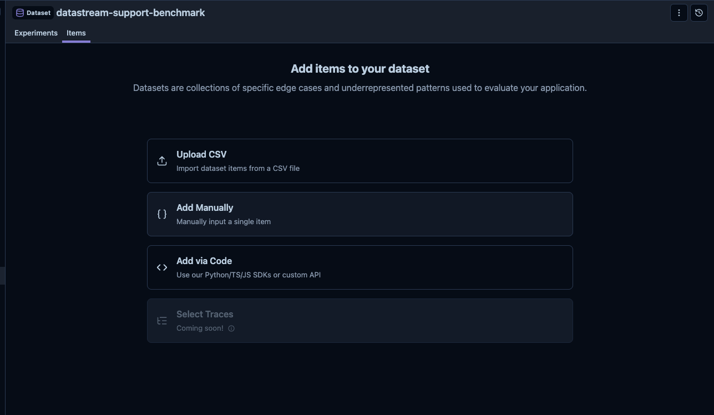

5. Add input and expected output as shown in the image below
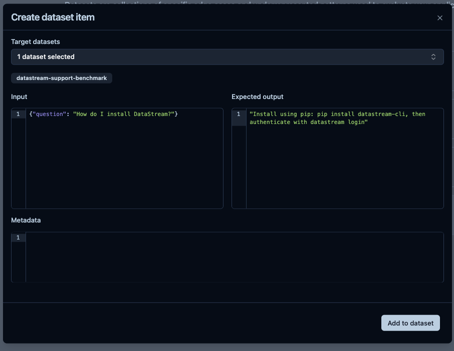

6. You should see item in the item list.
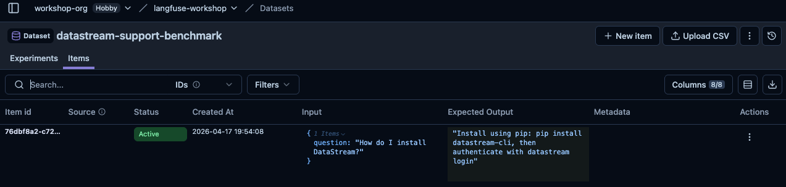

_Manually adding many items would take time. You could upload items with CSV file as well, however, we have created a python script that will populate items using code._

#### **Create items using code - Python **
The script `create_dataset.py` is already written. It populates *datastream-support-benchmark dataset* with 9 support questions and their expected answers.

1. Run it once:

```bash
python labs/07-offline-evals/create_dataset.py
```

_The script calls two Langfuse APIs:_

```python
# Initialize client, and dataset name
from langfuse import get_client

langfuse = get_client()
DATASET_NAME = "datastream-support-benchmark"

# Add each test case
langfuse.create_dataset_item(
    dataset_name="datastream-support-benchmark",
    input={"question": "How do I install DataStream?"},
    expected_output="Install using pip: pip install datastream-cli, then authenticate with datastream login",
)
# ... repeated for each test case
```
_Following is a a sample run_

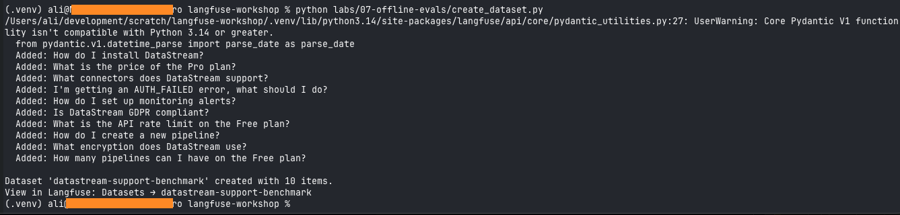


2. Verify the dataset appears in Langfuse → **Datasets**:

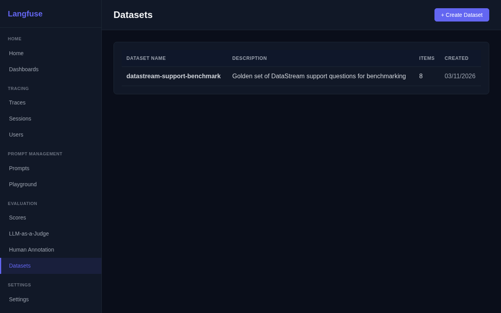

3. Click into it to see the 10 test items:

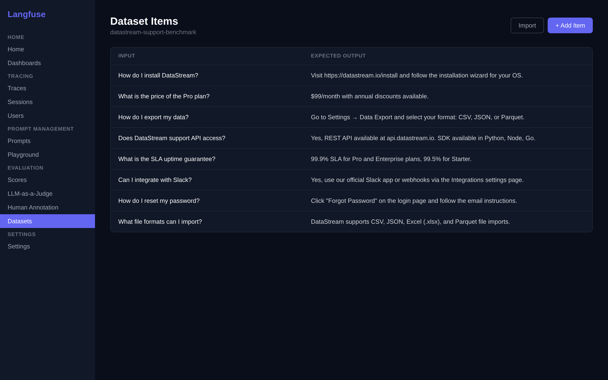

Now are dataset is ready to run experiments.

---

### Task 7.2 — Run an experiment

1. Navigate to Experiments tab in the Datasets screen and Click **Run experiment** button on the top right handside 
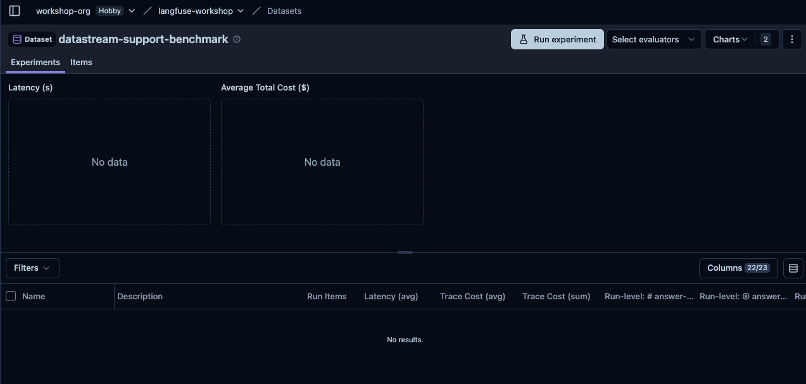

2. As you can see you can run experiment via User Interface or via SDK/API. We will use API, in fact we have already created a script for it. 
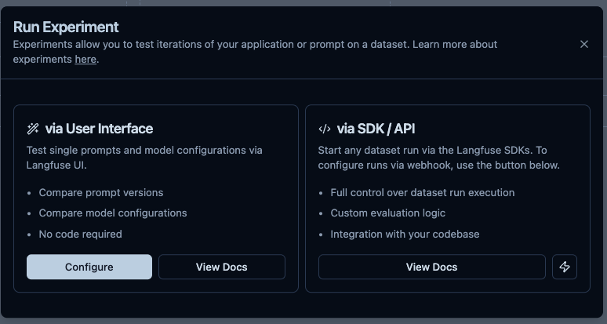

3. The experiment script is already written at `labs/07-offline-evals/run_experiment.py`. You can run it to begin the experiment:

```bash
python labs/07-offline-evals/run_experiment.py
```

Or pass a custom name:

```bash
python labs/07-offline-evals/run_experiment.py --name prompt-v1
```

### **How the script works:** 
it uses `dataset.run_experiment()` — the Langfuse SDK's high-level experiment runner. You define two functions and let the SDK handle the rest: looping over dataset items, linking each execution to a dataset run, and collecting scores.

```python
from langfuse import get_client, Evaluation
from app.assistant import answer

langfuse = get_client()

def run_task(*, item, **kwargs):
    """Run the assistant against one dataset item."""
    question = item.input["question"]
    response, _ = answer(question)   # answer() returns (text, trace_id)
    return response

def evaluate_item(*, input, output, expected_output, **kwargs):
    """Score the response using LLM-as-a-judge."""
    evaluation = judge(input["question"], expected_output, output)
    return Evaluation(
        name="answer-correctness",
        value=float(evaluation["score"]),
        comment=evaluation.get("reason", ""),
    )

dataset = langfuse.get_dataset("datastream-support-benchmark")
result = dataset.run_experiment(
    name="prompt-v1",
    task=run_task,
    evaluators=[evaluate_item],
)
print(result.format())
```

3. The SDK runs each item, calls your evaluator, and creates a named **dataset run** in Langfuse automatically.

_Followng is a sample output of experiment script_

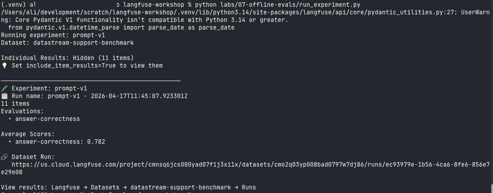
---

### Task 7.3 — Compare two prompt versions

Now lets update system prompt in Langfuse (create a new version with different instructions), then run the experiment again with a different name:

1. In Langfuse, go to **Prompts** → `datastream-system-prompt` → **New version** — add or change something meaningful (e.g., require the assistant to always mention relevant pricing, or always suggest contacting support for complex issues). Check **Set the production label** and save.

2. Run the experiment again with a new name:
   ```bash
   python labs/07-offline-evals/run_experiment.py --name prompt-v2
   ```

3. In Langfuse → **Datasets** → `datastream-support-benchmark` → **Runs**, you can now compare both experiment runs side by side:

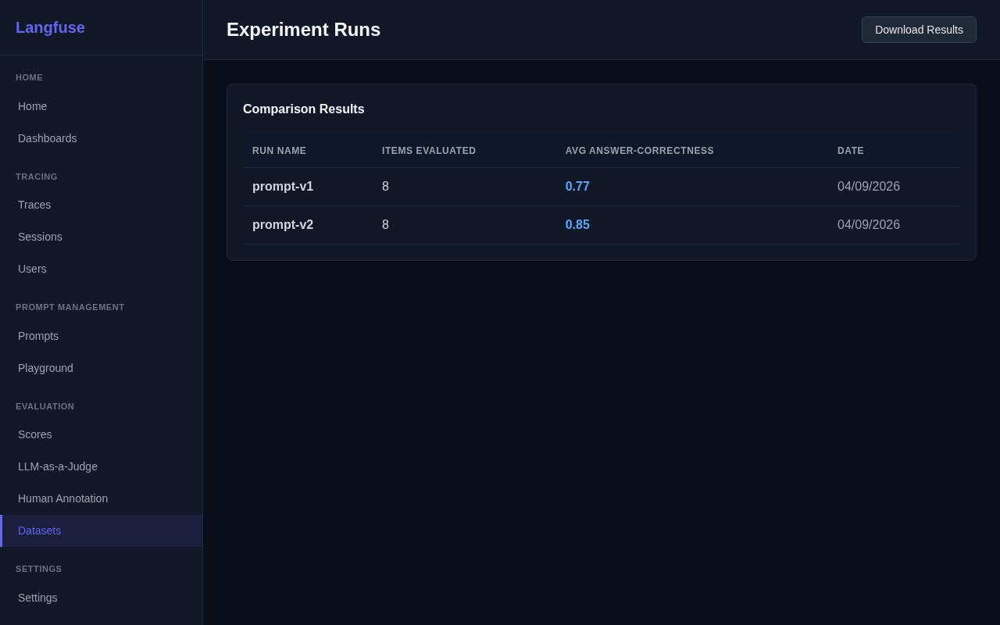

---

### Task 7.4 — Run a no-code experiment from the UI

You don't always need to write code to run an experiment. Langfuse can run a prompt directly against your dataset from the UI.

**Prerequisites**: Your dataset must have items with keys that match your prompt's variables. The `datastream-support-benchmark` dataset has a `question` key, but `datastream-system-prompt` uses `product_name`. For this task, create a simpler prompt:

1. Go to **Prompts** → **New Prompt**, name it `support-qa-prompt`, clic **Chat**
2. Add a system message: *"You are a helpful assistant for DataStream product."*

3. In the prompt next: `{{question}}`

4. Set label `production` and click **Create prompt**

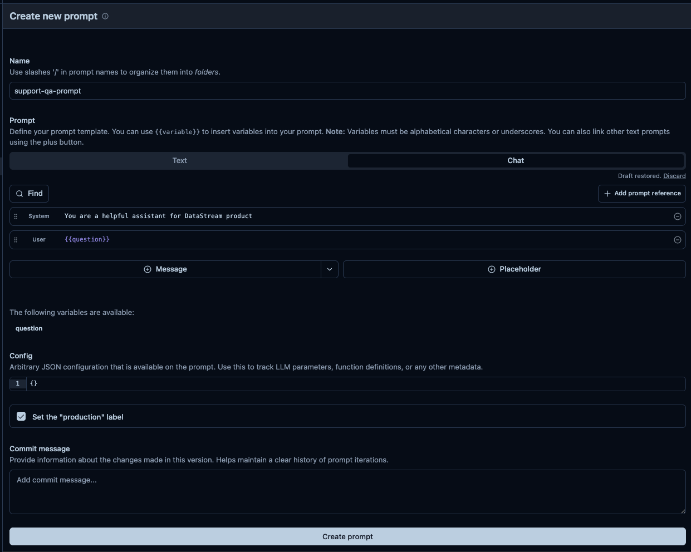

5. You should see prompt created with production label attached. 

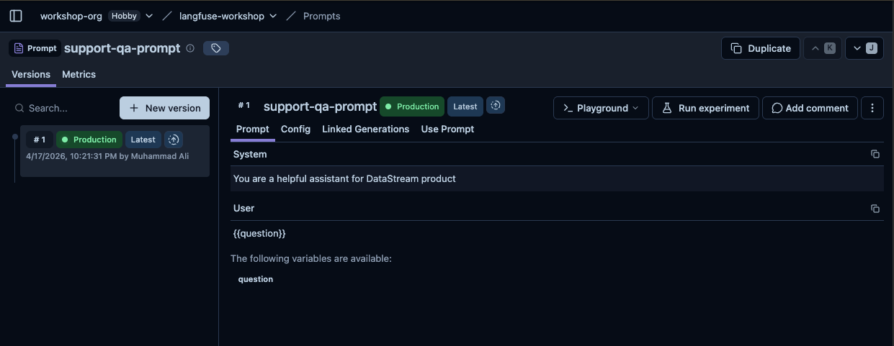

#### **Run the experiment:**
1. Go to **Datasets** → `datastream-support-benchmark` → **Run experiment** and select **Configure** under _via User Interface_

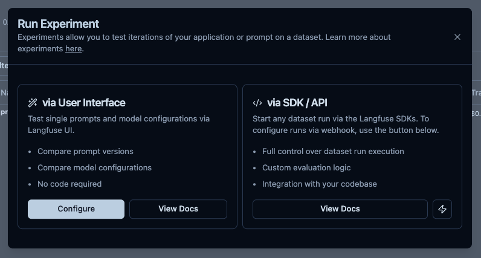

2. Select the `support-qa-prompt` prompt

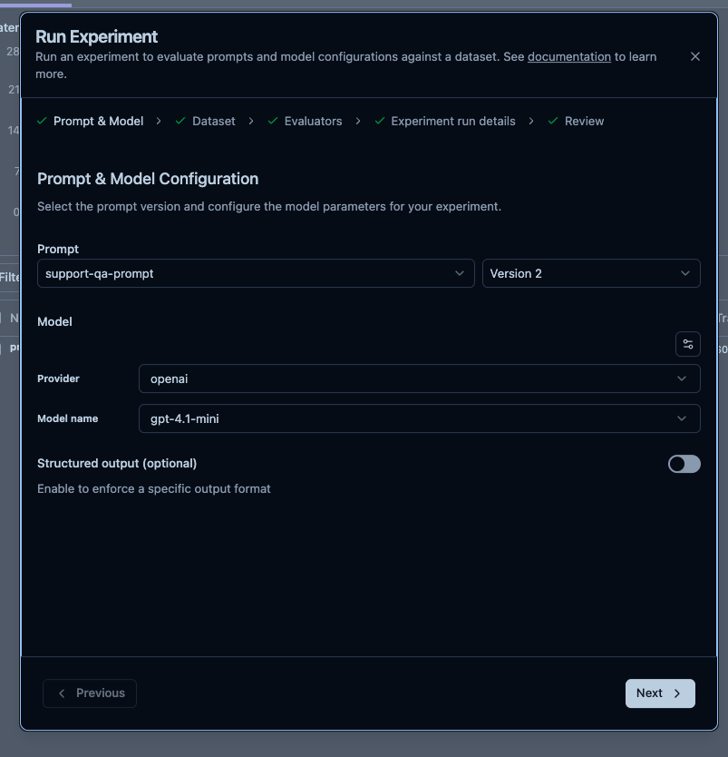

3. Select the `datastream-support-benchmark` dataset

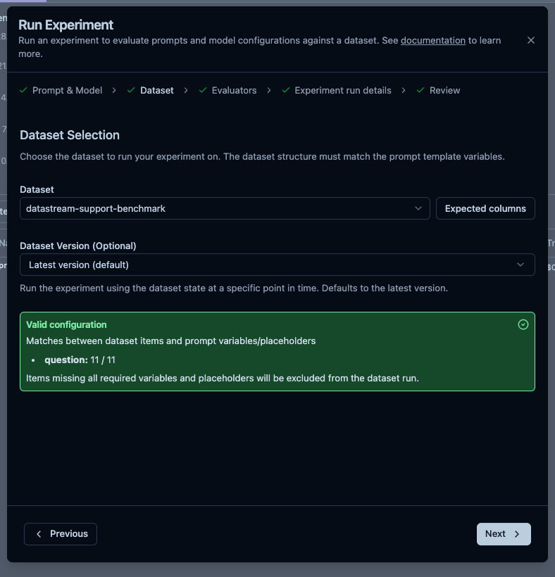

4. Optionally attach a Langfuse-hosted evaluator (e.g. Helpfulness). When you do set input and output mapping as specified in image below.

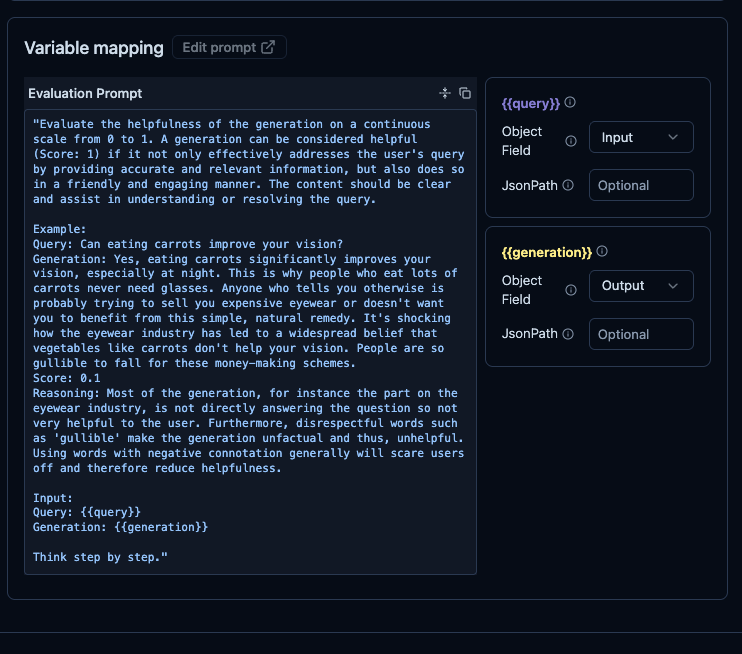

5. Review the experiment detail and click **Run Experiment**

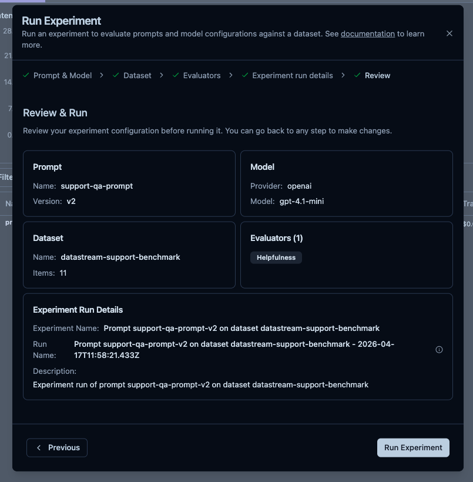


6. You should see the experiment in the experiment list. Give it a few minutes to kick off.

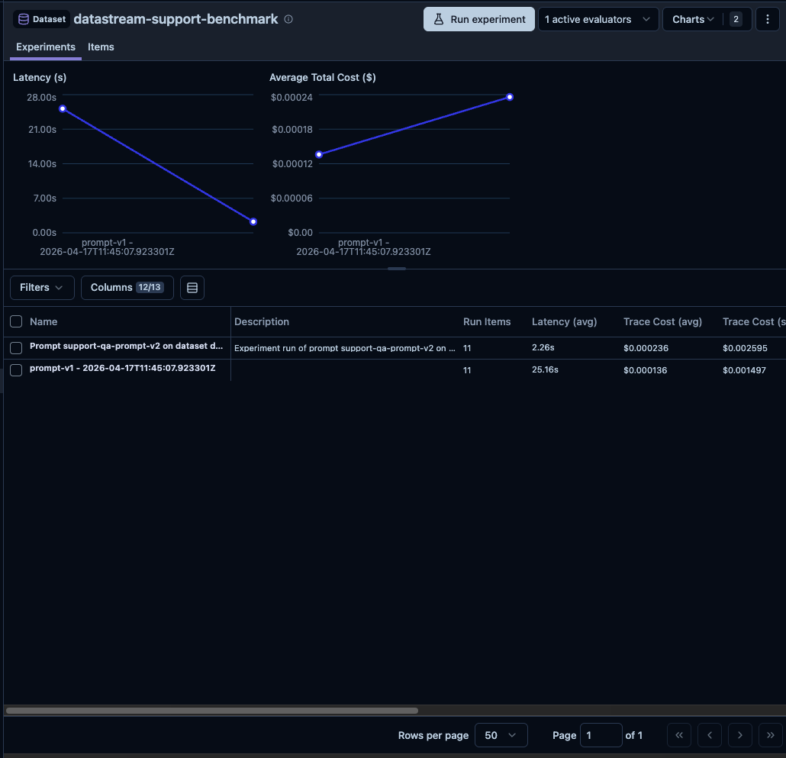

7. Once the experiment is running or finished you will see all items processed in a list.

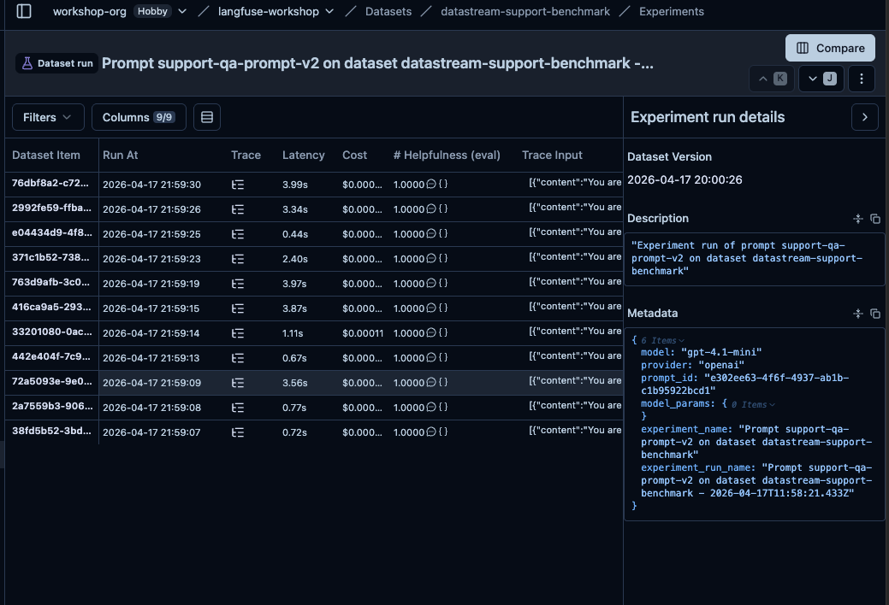

8. You can click **Compare** in the top and select experiments to compare.

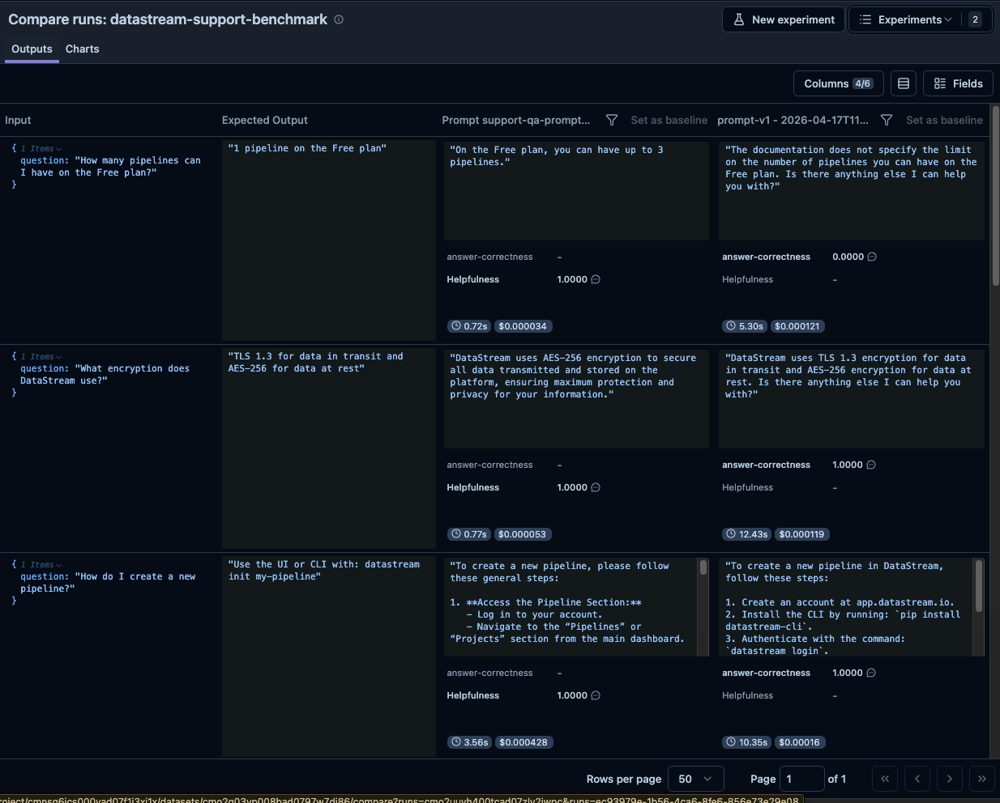

View the results in the **Runs** tab — each item shows the generated output and any scores. No Python required.

> This is useful for quick prompt testing: iterate on the prompt in the Playground, then immediately validate it against the full dataset to catch regressions.

---

### Task 7.5 — Add a production trace to the dataset

Datasets should grow over time with real failures. When you see a bad production trace, add it to the dataset so it becomes a permanent test case.

1. Go to **Tracing** → **Traces** and open a trace where the assistant gave a wrong or unhelpful answer.
2. Click **Add to dataset** in the trace detail panel.
3. Select `datastream-support-benchmark` and click **Add**.

The trace's input is now a dataset item. The next time you run an experiment, it will be tested — ensuring this failure can't silently regress.

> This closes the loop: production failures → dataset items → experiment test cases → caught before deployment.

---

## Checkpoint

- [ ] Dataset appears in Langfuse with 10 items
- [ ] First experiment run creates traces linked to the dataset
- [ ] Each trace has an `answer-correctness` score
- [ ] After changing the prompt, the second run shows different scores
- [ ] The dataset runs view shows both experiments for comparison
- [ ] A no-code UI experiment has been run against the dataset
- [ ] At least one production trace has been added to the dataset from the UI

---

## Why This Matters

Without datasets, you can only evaluate changes subjectively ("the responses seem better"). With datasets:

- You have a **regression test suite** — new changes can't silently break existing behaviour
- You can **A/B test prompts, models, or retrieval strategies** with confidence
- You build up a **benchmark** over time that reflects your real use cases
- You can **automate evaluation** as part of CI/CD before deploying prompt changes

Production traces are also a great source of dataset items: when you see a trace that went wrong, add it to the dataset so it becomes a test case.

---

## Scripts

- [`create_dataset.py`](./create_dataset.py) — creates the benchmark dataset in Langfuse (run once)
- [`run_experiment.py`](./run_experiment.py) — runs your app against the dataset and scores results

**Congratulations — you've completed the workshop!** 🎉
