# Lab 7: Offline Evals — Datasets & Experiments

## Concept

> To systematically evaluate and improve your application, you need two things:
> a set of **examples** that cover the scope your system is expected to handle,
> and a set of **evaluators** that tell you whether the system meets your expectations on those examples.

That's it — that's the entire offline-eval framework. Without examples you're guessing; without evaluators you're staring at outputs hoping to feel a difference.

**Datasets** are curated collections of input/expected-output pairs — the scope. **Experiments** run your application against the dataset; a platform **LLM-as-a-Judge** evaluator scores the results — the evaluator. Compare two experiment runs and you can finally answer "is prompt v2 better than v1?" with a number instead of a vibe.

```
Dataset                     Experiment A (prompt v1)    Experiment B (prompt v2)
──────────────────          ────────────────────────    ────────────────────────
Q: "How do I get started?"  → response + score: 0.8     → response + score: 0.9
Q: "What does Pro cost?"    → response + score: 0.9     → response + score: 0.85
Q: "Why is my auth failing?"→ response + score: 0.6     → response + score: 0.8
                            avg: 0.77                   avg: 0.85 ✓ (use v2)
```

The full loop:

1. **Scope dataset** — list the inputs and the expected outputs that define "good"
2. **Seed dataset** in Langfuse
3. **Configure evaluator** — an LLM-as-a-Judge in Langfuse that runs on dataset runs
4. **Run experiment** — your app against every item
5. **Inspect failures** — which items scored low, and why?
6. **Iterate on the prompt** based on the failures
7. **Re-run** under a new name and compare

---

## What You'll Build

1. Seed a benchmark dataset of 9 DataStream support questions with expected answers
2. Create a platform LLM-as-a-Judge evaluator (`answer-correctness`) scoped to Dataset Runs
3. Run a coded experiment — the platform evaluator scores it automatically
4. Inspect the failing items
5. Iterate on the system prompt and run a second experiment to measure the change
6. Run a no-code experiment directly from the Langfuse UI
7. Add a production trace to the dataset to prevent that failure from ever regressing

---

## Tasks

### Task 7.1 — Scope and seed the dataset

A dataset is a curated collection of `(input, expected_output)` pairs — your benchmark. The `expected_output` is *your opinion of what good looks like* for that input. Without it, there's nothing to score against.

You can create datasets and items in the UI:

1. Go to **Datasets** → **New dataset**, enter a name and description

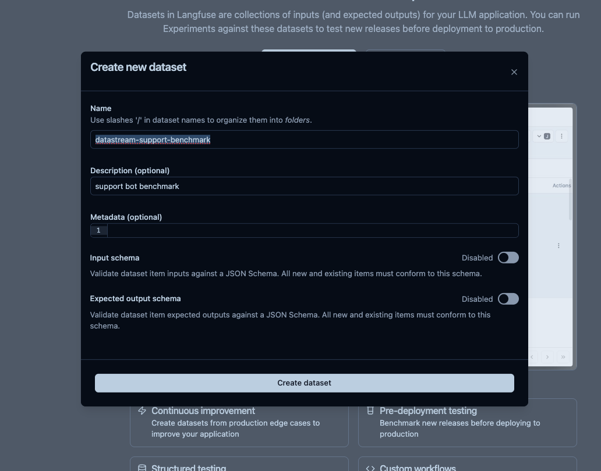

2. Open the new dataset → **Items** tab → **Add manually** to add an item

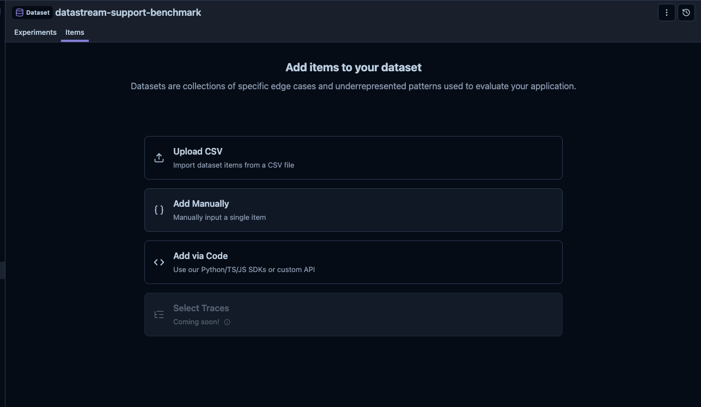

3. Adding many items by hand gets tedious. You can also upload a CSV, or — what we'll do here — populate the dataset via the SDK.

#### Seed items via code (the script is already written)

The script `create_dataset.py` populates `datastream-support-benchmark` with 9 representative support questions and their expected answers — covering pricing, connectors, troubleshooting, security, and billing.

Run it:

```bash
uv run python labs/07-offline-evals/create_dataset.py
```

The script uses two Langfuse APIs:

```python
from langfuse import get_client

langfuse = get_client()

# Add each test case
langfuse.create_dataset_item(
    dataset_name="datastream-support-benchmark",
    input={"question": "How do I install DataStream?"},
    expected_output="Install using pip: pip install datastream-cli, then authenticate with datastream login",
)
```

Sample run:

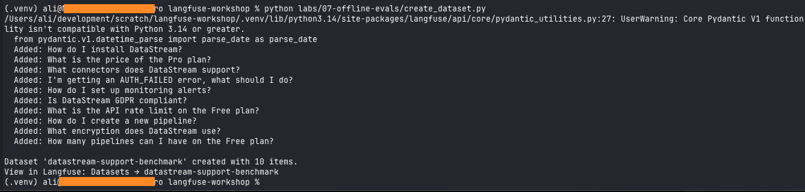

Verify the dataset appears in Langfuse → **Datasets**:

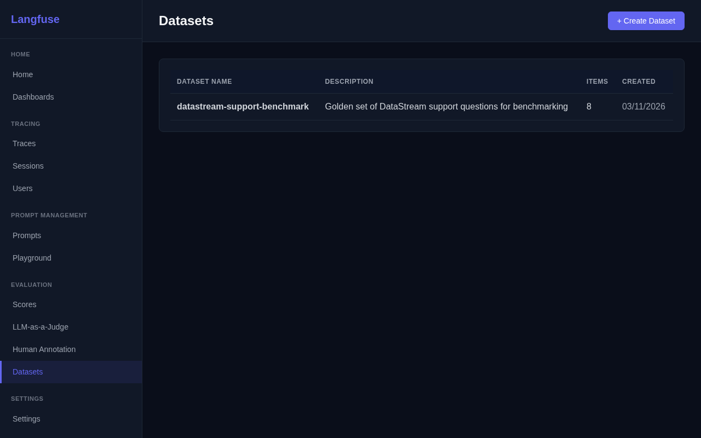

Click into it to see the 9 test items:

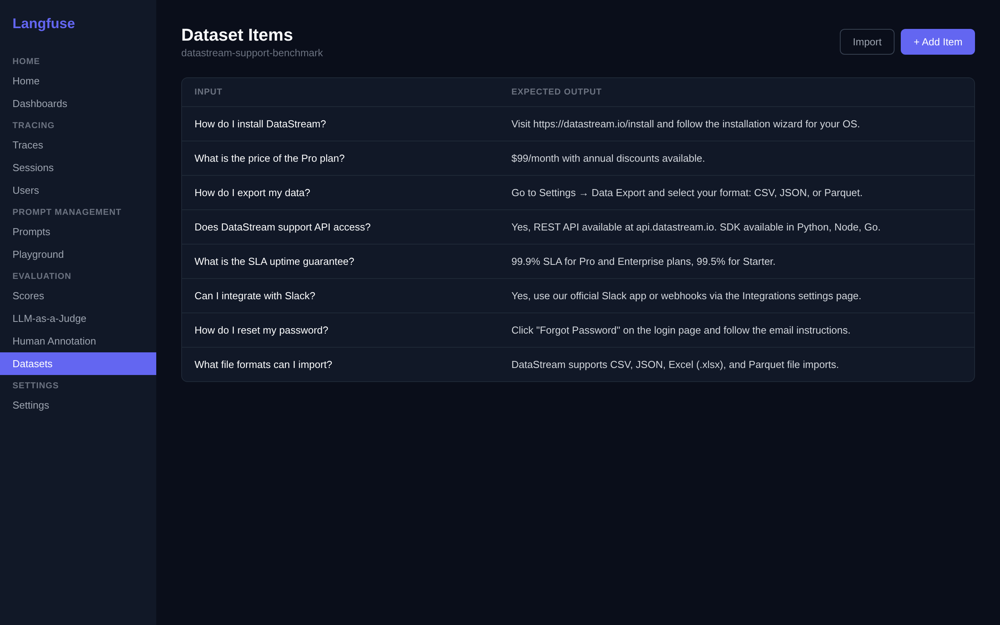

The scope is now defined. Next, the evaluator.

---

### Task 7.2 — Create the LLM-as-a-Judge evaluator in Langfuse

Before running any experiment, set up the evaluator that scores each run. We do this in the Langfuse UI — no code — so the rubric is configurable and applies to every future run against this dataset automatically.

This is similar to the LLM-as-a-Judge evaluator from Lab 5, but scoped to **Dataset Runs** instead of live observations.

1. Go to **Evaluation** → **LLM-as-a-Judge** → **Create Evaluator**


2. Choose **Custom** and name it `answer-correctness`
3. Set **Run on** to **Dataset Runs** (this is the key difference from Lab 5)
4. Select the dataset `datastream-support-benchmark`
5. Paste this rubric as the evaluator prompt:

```
You are evaluating a customer support response for correctness against
an expected answer.

Question: {{input}}
Expected key information: {{expected_output}}
Actual response: {{output}}

Does the actual response correctly answer the question and contain the
essential information from the expected answer? Partial credit is fine
if the response is mostly correct.

Respond with JSON only:
{"contains_answer": <true/false>, "score": <0.0 to 1.0>, "reason": "<one sentence>"}
```

6. Map variables to dataset run fields:
   - `input` → dataset item input → JsonPath: `$["question"]`
   - `expected_output` → dataset item expected output → JsonPath: `$`
   - `output` → experiment item output → JsonPath: `$`
7. Set sampling to `100%` → **Execute**

The evaluator is now active. Every experiment run against `datastream-support-benchmark` — whether triggered from a script or from the UI — will have its items scored automatically by this judge.

> **Why a platform evaluator instead of code?** Keeping the rubric in the platform means it's editable by a non-engineer, shared across all experiment runs, and applied uniformly without anyone having to remember to call it. Code-side evaluators (the `evaluators=` argument on `run_experiment`) are still available for custom logic — but for a standard LLM-as-a-judge rubric like this, the platform evaluator is the right default.

---

### Task 7.3 — Run an experiment

An experiment runs your real `answer()` function against every item in the dataset. The script is already at `labs/07-offline-evals/run_experiment.py`. Run it:

```bash
uv run python labs/07-offline-evals/run_experiment.py --name prompt-v1
```

#### How the script works

```python
from langfuse import get_client
from app.assistant import answer

langfuse = get_client()

def run_task(*, item, **kwargs):
    """Run the assistant against one dataset item."""
    question = item.input["question"]
    response, _, _ = answer(question)   # answer() returns (text, trace_id, observation_id)
    return response

dataset = langfuse.get_dataset("datastream-support-benchmark")
result = dataset.run_experiment(
    name="prompt-v1",
    task=run_task,
    # No evaluators= — the platform LLM-as-a-Judge handles scoring
)
print(result.format())
```

Notice there's no `evaluators=` argument. The `answer-correctness` evaluator you configured in Task 7.2 picks up each experiment item and scores it automatically — typically within 30–60 seconds.

Sample output:

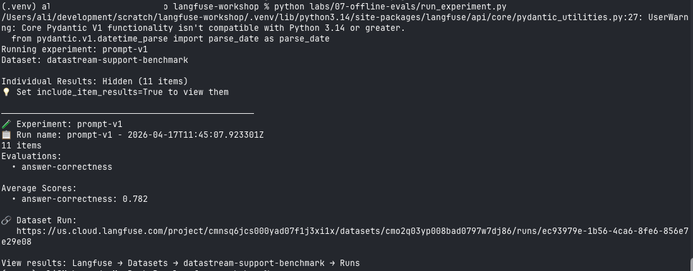

In Langfuse, go to **Datasets** → `datastream-support-benchmark` → **Runs**. You'll see `prompt-v1`. Wait a moment and refresh — `answer-correctness` scores will appear on each item.

---

### Task 7.4 — Inspect the failures

Average scores summarise; the value is in the failing items. Open the `prompt-v1` run, sort by `answer-correctness` ascending, and expand the low-scoring rows. For each, look at:

- the **question** (input)
- the **expected** key information
- what your assistant actually returned (output)
- the judge's **reason** comment — why it scored low

This is the moment "the answers feel off" becomes a concrete punch list: *"for these specific questions, the assistant is leaving out the plan name / using the wrong connector / making up numbers."* Now you have something targeted to fix.

---

### Task 7.5 — Iterate on the prompt and re-run

Now the loop closes. Update the system prompt based on what you saw, and re-run the experiment under a new name to measure the change.

1. In Langfuse, go to **Prompts** → `datastream-system-prompt` → **New version**. Add a guideline targeting your failure pattern — for example:

   ```
   - Always cite the specific plan name and price when discussing pricing.
   ```

   Check **Set the production label** and save.

2. Run the experiment again with a new name:

   ```bash
   uv run python labs/07-offline-evals/run_experiment.py --name prompt-v2
   ```

3. In Langfuse → **Datasets** → `datastream-support-benchmark` → **Runs**, you can now compare both experiment runs side by side. The `answer-correctness` evaluator scores `prompt-v2` with the same rubric it used for `prompt-v1` — which is what makes the comparison fair:

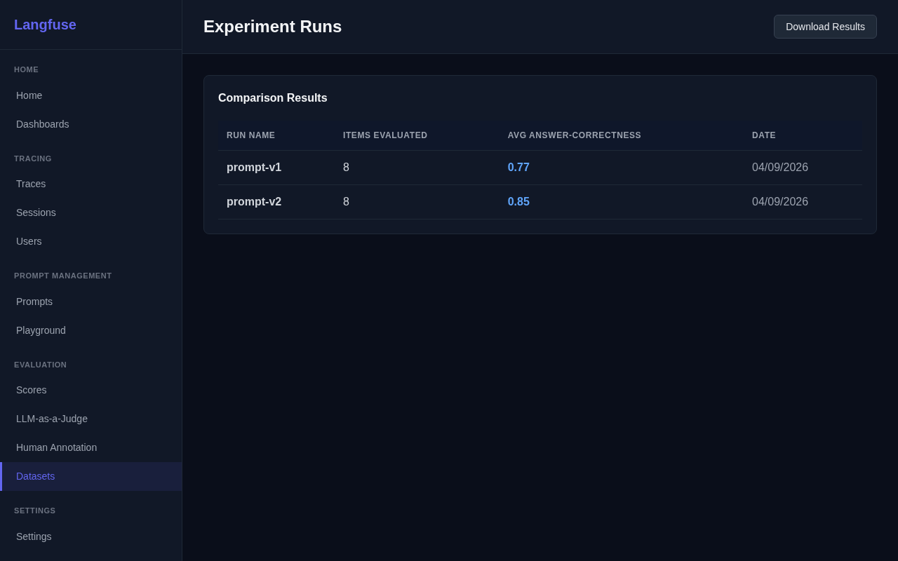

Look at:

- **Average score** — did the change help overall?
- **Items you targeted** — did *those specific items* go up?
- **Items that previously scored well** — any regressions? (this is how you catch a "fix" that breaks other things)

This is the whole point: replacing *"I think it's better"* with *"the new prompt scores 12% higher on the benchmark, with one regression on item 4 we should look at."*

---

### Task 7.6 — Run a no-code experiment from the UI

You don't always need to write code to run an experiment. Langfuse can run a prompt directly against your dataset from the UI — useful when a PM or designer wants to try a prompt without involving engineering.

**Prerequisites**: Your dataset must have items with keys that match your prompt's variables. The `datastream-support-benchmark` dataset has a `question` key, but `datastream-system-prompt` uses `product_name`. For this task, create a simpler prompt:

1. Go to **Prompts** → **New Prompt**, name it `support-qa-prompt`, click **Chat**
2. Add a system message: *"You are a helpful assistant for DataStream product."*
3. In the user message field, add: `{{question}}`
4. Set label `production` and click **Create prompt**

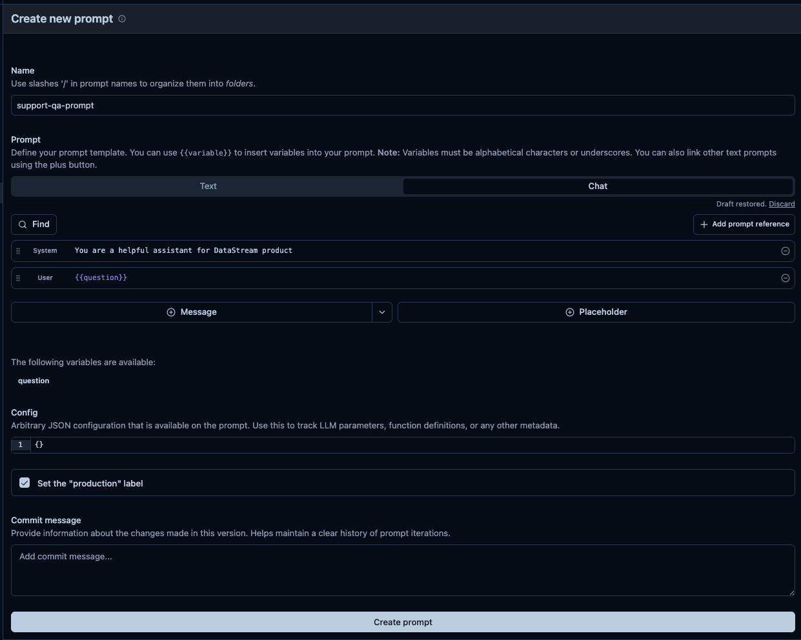

#### Run the experiment

1. Go to **Datasets** → `datastream-support-benchmark` → **Run experiment** and select **Configure** under _via User Interface_

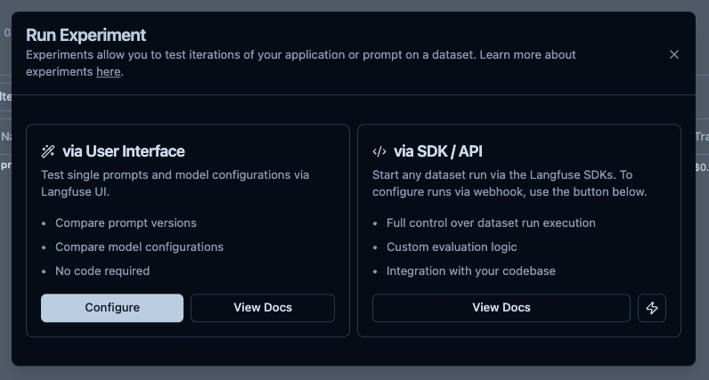

2. Select the `support-qa-prompt` prompt

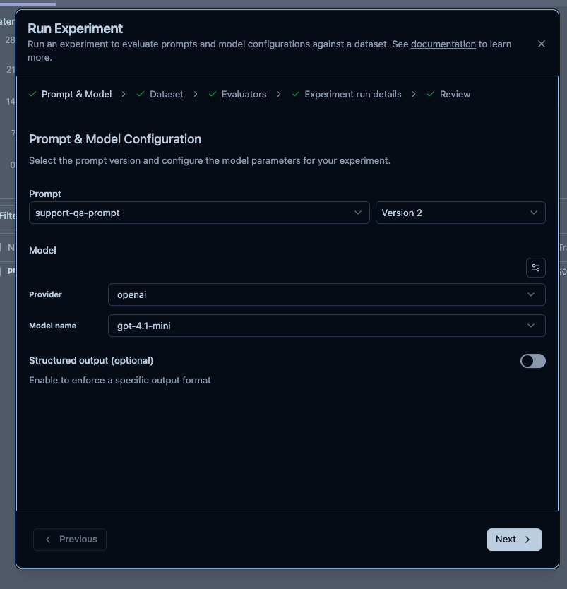

3. Select the `datastream-support-benchmark` dataset

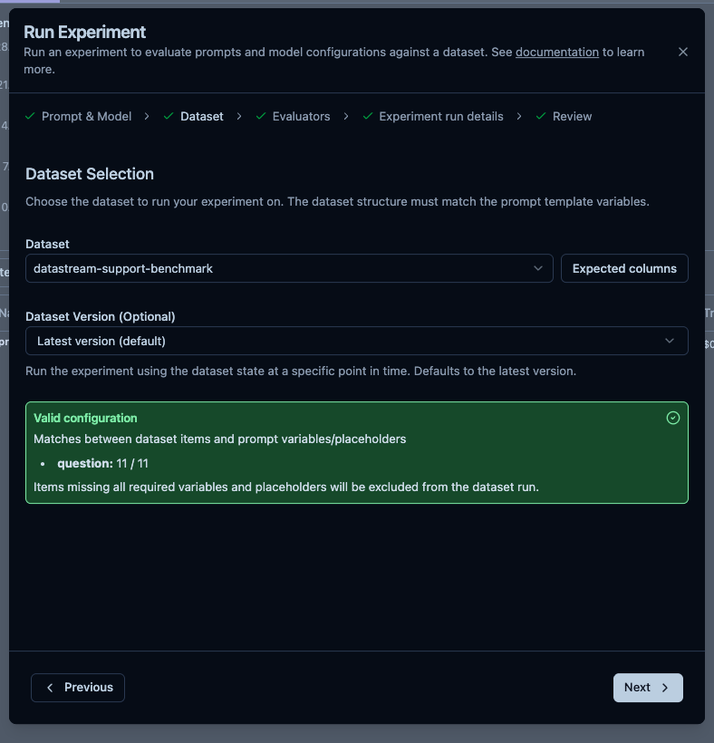

4. Your `answer-correctness` evaluator already runs on every Dataset Run for this dataset — it'll score this UI run too, automatically.

5. Review and click **Run Experiment**

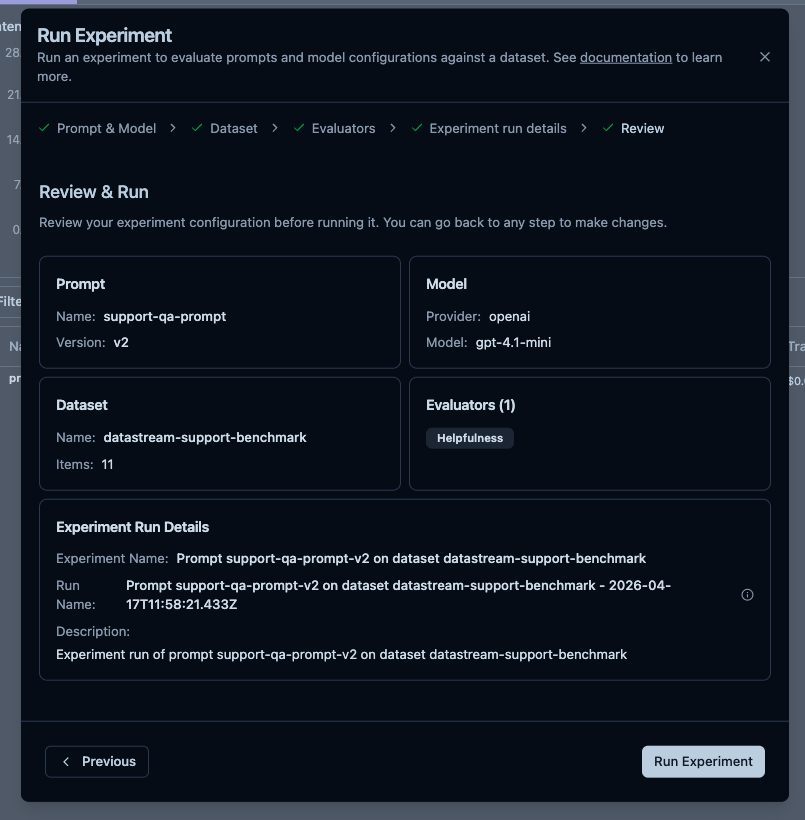

6. The new run appears in the experiments list:

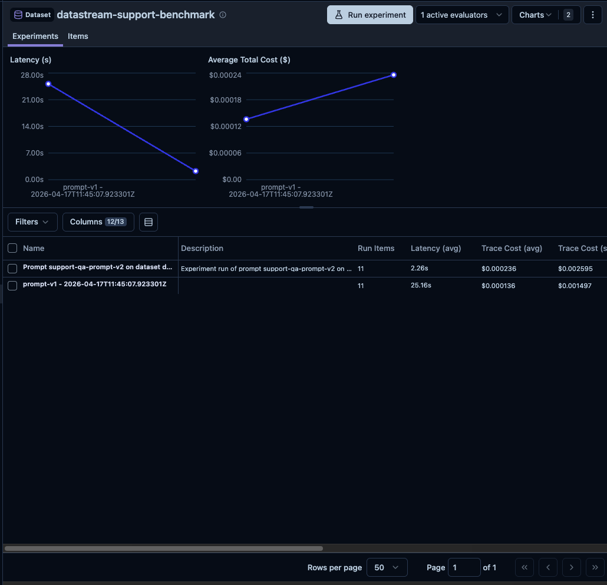

7. Once it's running or finished you'll see all items processed:

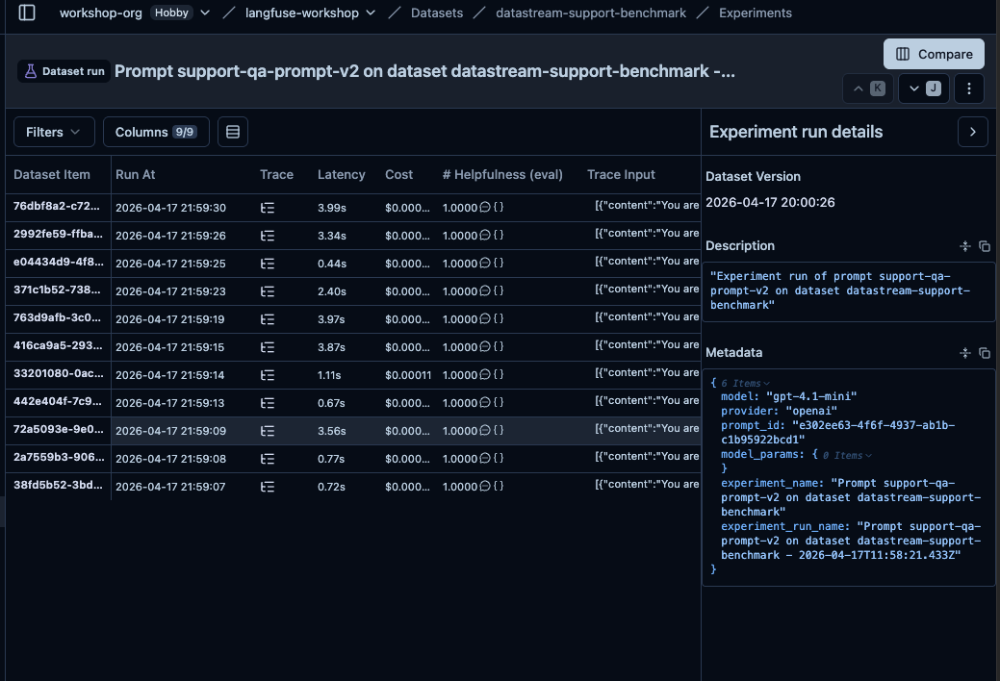

8. Click **Compare** at the top to compare runs:

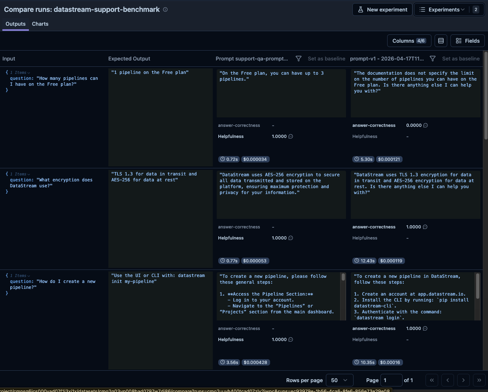

> Useful for quick prompt testing: iterate in the Playground, then immediately validate the new prompt against the full benchmark.

---

### Task 7.7 — Add a production trace to the dataset

Datasets should grow with real failures. When you see a bad production trace — for example a trace where the Lab 5 `in-scope` or `user-feedback` score is low — add it to the dataset so it becomes a permanent test case.

1. Go to **Tracing** → **Traces** and open a trace where the assistant gave a wrong or unhelpful answer.
2. Click **Add to dataset** in the trace detail panel.
3. Select `datastream-support-benchmark` and click **Add**.

The trace's input is now a dataset item. The next time you run an experiment, the `answer-correctness` evaluator will score it — ensuring this failure cannot silently regress.

> This closes the loop: production failures → dataset items → experiment test cases → caught before deployment.

---

## Checkpoint

- [ ] Dataset appears in Langfuse with 9 items
- [ ] `answer-correctness` LLM-as-a-Judge evaluator is active, scoped to Dataset Runs
- [ ] First experiment run creates traces linked to the dataset
- [ ] Each experiment item gets an `answer-correctness` score from the platform evaluator
- [ ] You inspected the failing items and identified a pattern
- [ ] After changing the prompt, the second run shows different scores
- [ ] The dataset runs view shows both experiments for comparison
- [ ] A no-code UI experiment has been run against the dataset
- [ ] At least one production trace has been added to the dataset

---

## Why This Matters

Without datasets, you can only evaluate changes subjectively. With them you have:

- A **regression test suite** — new changes can't silently break existing behaviour
- A way to **A/B test prompts, models, or retrieval strategies** with a number, not a vibe
- A **growing benchmark** that reflects your real production failures
- **Automated evaluation** in CI/CD before deploying a prompt change

---

## Scripts

- [`create_dataset.py`](./create_dataset.py) — creates the benchmark dataset in Langfuse (run once)
- [`run_experiment.py`](./run_experiment.py) — runs your app against the dataset; scoring is handled by the platform LLM-as-a-Judge evaluator

**Congratulations — you've completed the workshop!** 🎉
